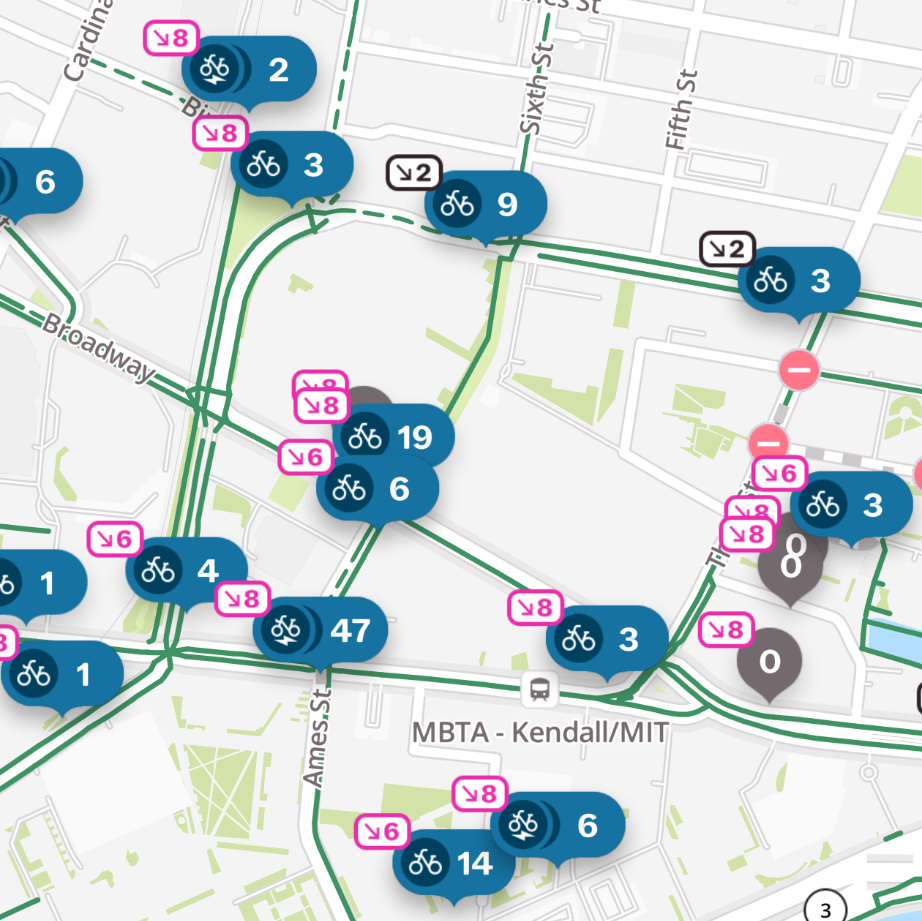
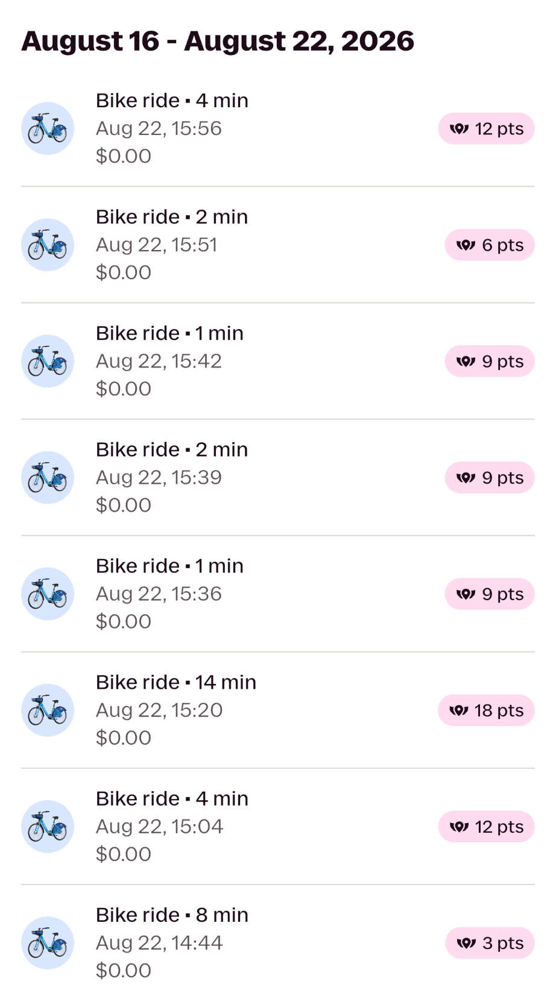

Longtime readers of this blog will know that I am a big fan of biking in Boston, and especially, the [BlueBikes](https://bluebikes.com/) system. BlueBikes is a network of stations spread across the city with docks and bikes. You just go to any station, grab a bike, ride it to any other station, and dock it!

The basic pricing for BlueBikes can be a bit high -- $3 per ride is a bit more than subway fare for a transportation method you literally have to power yourself, and the base fare only covers 30 minutes of riding time. Worse, e-bikes cost an extra 33 cents per minute, which leads to some routes potentially being more expensive than the same trip on Uber depending on the time of day.

The secret to making the system economical is memberships. While you can get a monthly membership, if you bike more than four months out of the year it makes more sense to get a yearly one. Members get an unlimited number of free 45-minute rides on non-electric bikes, and they pay a reduced e-bike price of 10 cents per minute with no unlock fee. I pay \$133.50/year for a membership, and if I hadn't had one, I would've paid \$520 over the course of the year.

## Bike Angels

But there's one additional perk of memberships that you have to explore a bit to discover: Bike Angels! The Bike Angels program places a point value on each station: a station can have between 1 and 4 pickup points, or between 1 and 4 dropoff points, or no points. You earn points by picking up bikes from stations with pickup points, and by dropping off bikes at stations with dropoff points.

Point values are visible on the station map. I have a 2x streak, causing the displayed points values to be doubled.

Once you opt into the program, point values appear on your station map. For a while, I had the program turned on. I have a few stations near my work and a few near my home, so if one of those stations had points available, I could choose to take it to earn points on my commute. Over two years, I slowly accumulated 100 points.

Bike Angels points can be redeemed for a few rewards, such as e-bike credits, an extension to your BlueBikes membership, or even gift cards. However, buried away in another section of the app is another reward: _Joy Rider_.

Unlike the other rewards which draw points from your points bank, earning Joy Rider is based on the total lifetime accumulated points on your account. Once you reach 250 points, the amount of time you have to keep a bike unlocked goes from 45 minutes to 60 minutes for the lifetime of your account! I set my sights on this pretty much immediately after learning about it. In addition to bragging rights and feeling special, I've been wanting to get into more longer distance riding for pleasure and exercise. Being able to ride for 60 minutes at a time gives me more possibilities for destinations -- I've been meaning to bike up to Salem, for instance, but there's a large gap in stations along the route -- and just makes riding around town more convenient when I don't have to keep swapping bikes.

## Game Theory!

One of the key aspects of earning Bike Angels points is managing your streak. If you take enough rides with a positive point value, you can multiply the points you earn by 3x, which massively increases the amount of points you can earn. This massively stacks the cards in favor of those who dedicate time for long Bike Angels runs: earning 100 points by taking a few one-off rides for my commute took me two years, but earning 100 points by doing rides purely for Bike Angels took me only two hours.

Importantly, it doesn't matter how many points you earn in each of the four positive rides you need to get to the maximum streak, so the best strategy is often to find some easy, low-points routes at the start so that your streak is fully charged up for more time consuming higher-points routes later on.

Taking any ride which starts at a station with dropoff points or ends at a station with pickup points will end your streak. Since entire swaths of the city map are often covered in one or the other, it's possible to get "stuck" surrounded by stations with dropoff points, requiring either a long walk or some clever transit use to get to a station where you can pick up a bike. The point values change every 15 minutes (on the :00, :15, :30, and :45), so keep an eye on them as they happen! It's possible that the station you planned to drop your bike at becomes a station with pickup points, or vice versa, and you'll need to change your plans.

It's worth occasionally zooming out on the station map to check for areas with high point values. In my experience, Kendall Square and Harvard Square are often great options. Since you're already on a bike, getting between these regions is often quite easy!

Generally, the best way to rack up points quickly is to find a station pair, and do loops of taking a bike from one, riding it to the other, and walking back. That might sound repetitive, but since points rebalance every 15 minutes, earning opportunities will constantly be moving around on the map and you'll have to keep up. Ideally, you want to find two stations very close together for this -- the distance you're willing to walk should be proportional to the amount of points you'll earn in the process (pickup points at the origin station plus dropoff points at the destination station). Sometimes that means taking a few beautiful 5-minute rides through Harvard Square for 12 points per ride, and sometimes that means moving a ton of bikes between stations that are only 200 feet away from each other and getting weird looks from onlookers. It's a surprisingly varied experience!

My rides ended up being a mix of longer runs for higher point values and shorter runs for lower point values.

You can also chain various routes into a "milk run" style, which is especially useful for when you want to be in another area of town. When planning routes that aren't loops, always look at the stations around your dropoff station and have an idea in mind for where you'll pick up your next bike. If there's an area with similar point values at all of the stations, picking the one closest to a station where you can pick up another bike can save you a lot of time!

It might seem like you can totally game the system if you find two stations close together by moving tons of bikes between them during one 15-minute interval, causing the point values to flip to the other direction, then moving them all back during the next 15-minute interval, and so on... This does work, but they will ban you if they catch you. Also, it's a lot less fun in my opinion.

## Why do Bike Angels?

So, why should you do grunt work for the BlueBikes system operators? While it's the only way to get Joy Rider, you'd probably have to value your time and energy pretty low for it to be worth it on its own for the membership extensions and gift cards. But beyond the perks, I really enjoyed the experience overall and will definitely be doing some Bike Angels farming again!

Doing Bike Angels requires a lot of quick thinking and problem solving. Maybe your plan for getting your next bike fell through when a station switched from pickup to dropoff points, or maybe you're trying to decide whether to head towards downtown Cambridge or downtown Boston, or maybe you're trying to decide which of two station pairs give you the best options for earning points. Knowledge of the city layout, the locations of stations and bike lanes, and even the transit routes nearby can be really helpful. (The Cambridge EZRide saved me on one occasion when I was stuck in the heart of Kendall and the nearest pickup points station was a 30 minute walk away!) The best way I can describe it that it's kind of like playing a scavenger hunt or an augmented reality game like Pokemon Go.

Seeing different parts of the city was really fun, too. I got to see parts of the city I had never been on before, from quiet residential neighborhoods to blocks full of office buildings. After getting lost in the Novartis campus, discovering countless city parks I had no idea existed, and crossing lots of new routes and trails off my bucket list, I can confidently say that this experience contributed so much to my understanding of and my appreciation for the place I live.
