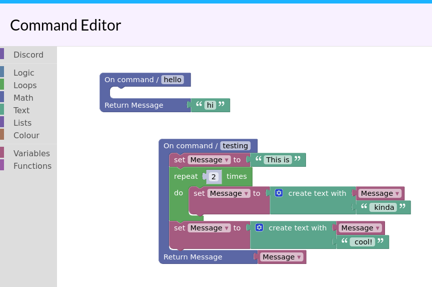

<Caption>A couple demo commands built using Blockly.</Caption>

# Overview

BotBuilder is an online tool that allows people to build custom Discord commands by dragging blocks. These commands are then added as slash commands to the user's guild ).

# Motivation

After building the [flask-discord-interactions](/projects/flask-discord-interactions) library, I realized how Discord's Interactions API could enable interesting custom commands with less overhead than a traditional Gateway-based bot. Many of my friends wanted to create their own Discord bot to include custom commands, but running a Discord bot typically requires registering as a developer, finding hosting, handling tokens, installing a library, writing code, and other tasks that might prove difficult for someone inexperienced with programming. I wanted to create a service that would allow users to add custom commands to their Discord servers without any prior knowledge of bot development or code.

# Technical Description

Users log in with their Discord account using OAuth2 to access their workspace. There, they are able to use [Blockly](https://developers.google.com/blockly) to create commands.

When users edit their workspace, the workspace is converted to XML and uploaded to the BotBuilder server, and if they close and reopen the workspace, their previous workspace is automatically downloaded and restored. At each upload, each command is also compiled into JavaScript, and each JavaScript function is uploaded to the BotBuilder server.

Initially, users must click the "Add To Server" button, which will direct them through Discord's OAuth2 flow to authorize BotBuilder to add commands to their guild. After this, when new commands are uploaded, the BotBuilder server calls the Discord API to update the slash commands present in each of the user's guilds, adding any new commands and removing any deleted ones. It also maintains which set of users push commands to which guilds in a Redis database.

When a command is executed in one of these Discord servers, Discord will send a POST request to BotBuilder. After verifying the cryptographic signature of this request, BotBuilder will look up which users added commands to the guild, and look through these commands for one that matches the incoming request.

After identifying the command, BotBuilder will execute the JavaScript code and return the result as a response to the POST request. To execute JavaScript, I'm using [PyMiniRacer](https://github.com/sqreen/PyMiniRacer/), a tool developed by [Sqreen](https://www.sqreen.com/) to run and interact with Google's [V8](https://v8.dev/) JavaScript engine from Python.

I chose to use JavaScript as the compilation target for the commands for security reasons. Executing, say, Python code in a sandbox would be difficult to do securely. JavaScript, on the other hand, is designed to be run in the browser, which is an inherently sandboxed environment.

# Results

Not many of my friends ended up using this. I think the main reason was beacuse not enough features were present, and most people who wanted to make a custom command would need more functionality. Some of this was a limitation of Discord--without a bot user, the Interactions API is much more limited, and it doesn't allow applications to look up user information, modify roles, or do other actions that most bots typically do. However, supporting additional features like custom command arguments and HTTP request blocks would have maybe turned this into a more useful service.
