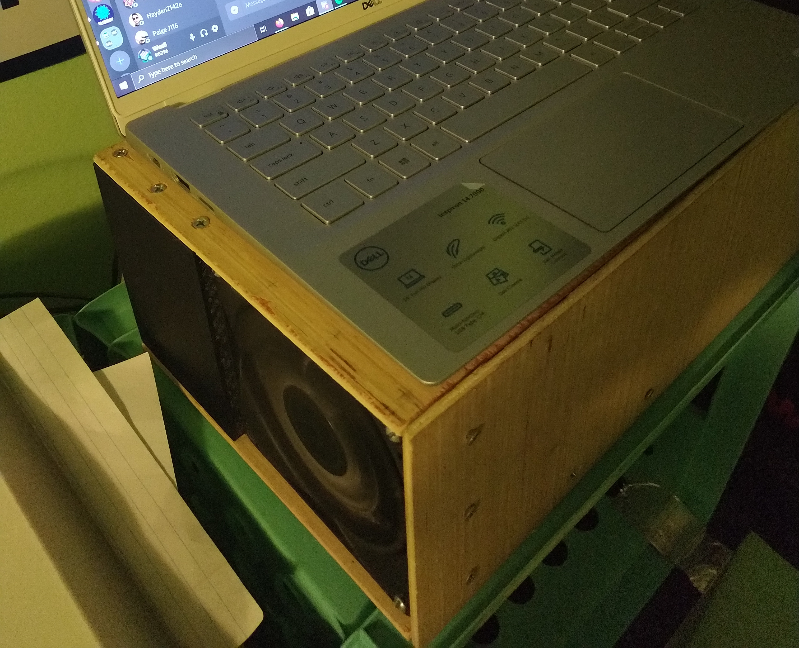
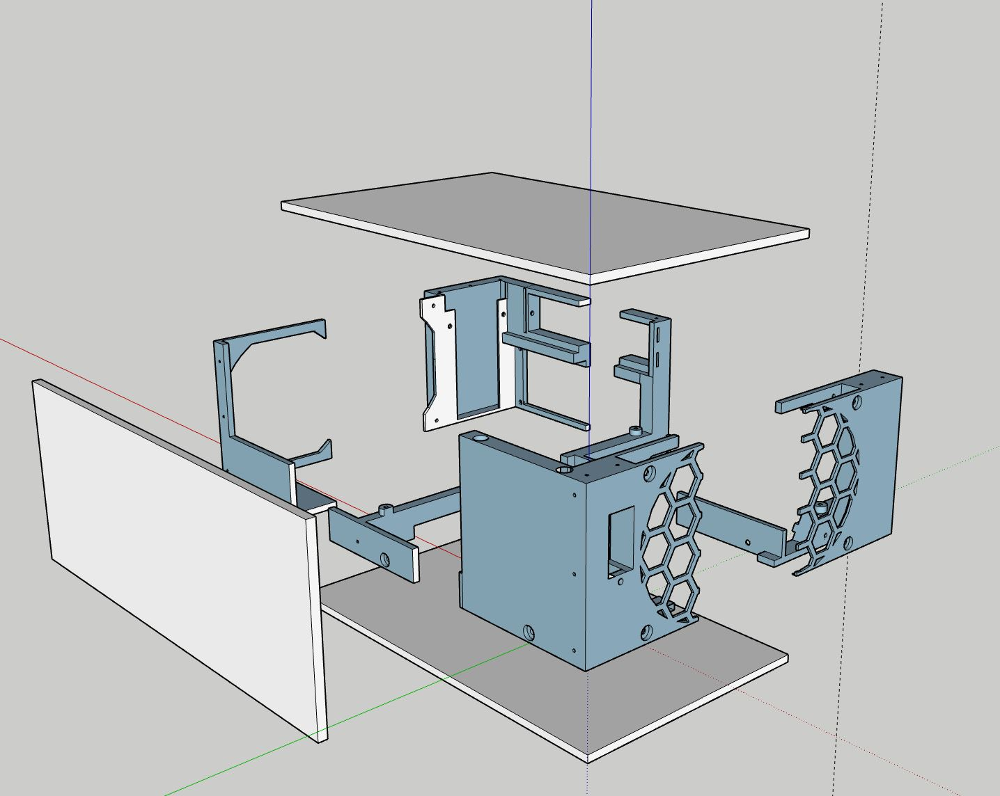
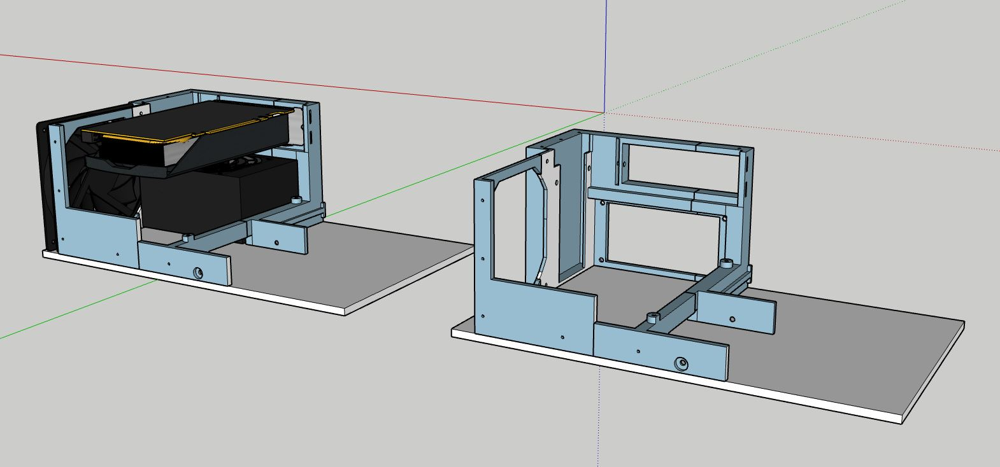
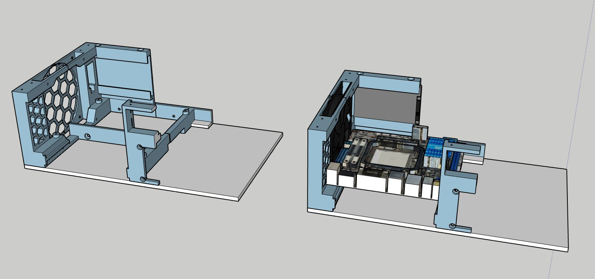

<Caption>
The finished product had about the same footprint as my laptop.
</Caption>

In late 2018/early 2019, I decided to build a desktop computer for use doing 3D rendering and experimenting with machine learning.

Unfortunately, I didn't document my work nearly as well as I should have, so this writeup is going to be a bit heavy on the renders and light on the photos.

# Overview

This was a custom-built PC case that houses a mini-ITX motherboard, SFX power supply, and small-form-factor GPU. It was built out of a mix of wooden parts and 3D-printed parts that I designed.

# Motivation

Around this time, I had started taking 3D rendering at MSSM, and I was disappointed with the poor rendering performance of my laptop. I decided that I wanted to build a more powerful computer that would better handle tasks like 3D modeling, rendering, and deep learning. In order to get the best sustained performance at my price point, I decided to go with a desktop instead of a higher-end laptop or a NUC.

However, I wasn't a big fan of how large most desktop computers were. Most PC cases seemed extremely large, which wasn't convenient for me at all, since I had to go back and forth to MSSM every month at the time. While form factors like ITX (motherboards) and SFX (power supplies) had started to take off, even cases built for them seemed excessively large.

I decided to build my own case, with a goal of making something no larger than a few vertically-stacked binders. I wanted it to be able to fit in my backpack or suitcase to make transportation easy.

# Technical Description

The case consists of three wooden panels (the top, bottom, and front) that all screw into the 3D-printed interior structure. Because my 3D printer has only 120mm of build plate space, the interior is split into 6 separate sections which are held together by their mutual attachment to the wooden panels.

The case contains two distinct airflow zones--one for the GPU and one for the CPU. The GPU slots into the left side of the case, connecting to the motherboard using a riser. The PSU sits directly underneath it. Additionyally, there is space for an SSD alongside the fan.

On the left side, a hard drive sits underneath the motherboard, and there is space for an additional drawer for storing USB cables or other small parts. Above these, the motherboard sits on standoffs, and an SSD can attach to the front. This area has its own fan which blows air mostly above the motherboard, but some goes towards the hard drive as well.

In the far corner of the render, you can see a small keyhole shape. This is a place where power button, status LED, or other types of modules can be inserted. I only ever made one such module, a simple on/off switch.

# Results

I used this case for over a year, and it held up pretty well. By the end of its life, the power button had broken, and the screws were starting to strip inside the 3D-printed plastic. However, structurally, it held up well, even after getting roughly tossed into a suitcase many times.

After I came back home from MSSM, I transferred my rig back over to an off-the-shelf case, since I had plenty of space for it. That said, I certainly wouldn't call the project a failure--it was a great case for the 2 years or so that I used it, and I learned a lot about 3D printing in the process. Specifically, this project made me really consider the structural qualities of a 3D print, and I had to choose the orientation of each piece carefully in order to ensure each one was strong. While I used up plenty of filament in the process, by the end, this was something that I'm really proud of!
