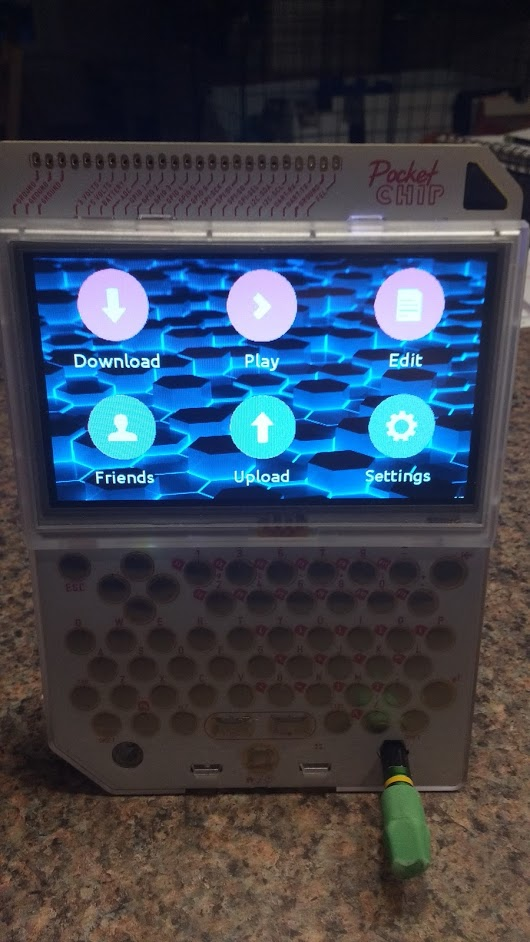

<Caption>
MakerGamer running on a PocketCHIP
</Caption>

# Overview

MakerGamer was a virtual video game console designed to make game development as accessible as possible and to encourage the sharing of games. It could play games written in Scratch, Python, and JavaScript, and it provided basic tools to modify the games people downloaded. I wrote it with the intent of running it on Next Thing Co.'s [PocketCHIP](https://www.theverge.com/circuitbreaker/2016/7/19/12227806/pocketchip-review-portable-linux-computer).

# Motivation

This project was inspired by Pico-8, a “fantasy console” that allowed people to write retro-feeling games for modern hardware. However, the learning curve for using Pico-8 was high, and I thought it would be cool to create something in the style of Pico-8 but that would be suitable for people learning to code for the first time. I set out to create a similar “fantasy console” that could play games written in Scratch but felt like a traditional video game console.

# Technical Description

I designed and programmed an interface for downloading Scratch projects by the project ID, adding them to a virtual library, and playing them on demand, using [Phosphorous](https://phosphorus.github.io/) to run then without Adobe Flash. Python games written using PyGame were executed with parameters set to make PyGame full screen. Web-based games were downloaded and opened in a web browser. The user interface (main menu, project editors, etc) and the code editor were written in Python using PyGame.

# Results

It worked well enough for me to demo it to people at the STEM fair. But it didn't really have that much actual use, as all the games could be played in a web browser anyway. I eventually scrapped plans to finish the project-editing functionality, as it wasn't practical to write a code editor, image editor, and etc. that only ran on a tiny screen anyway.
