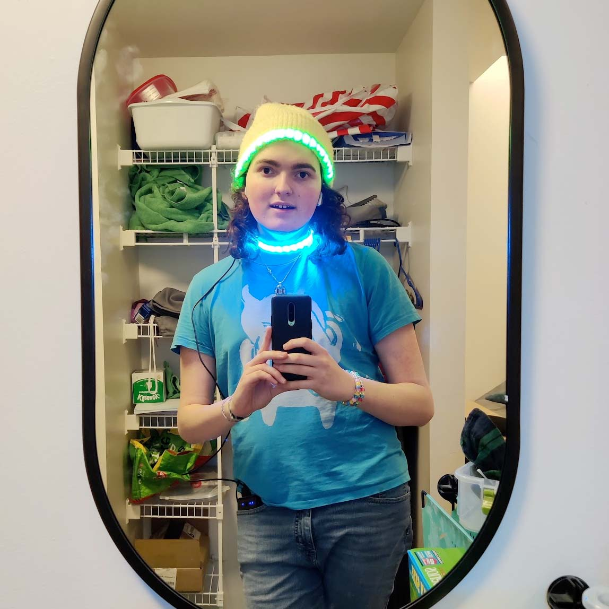
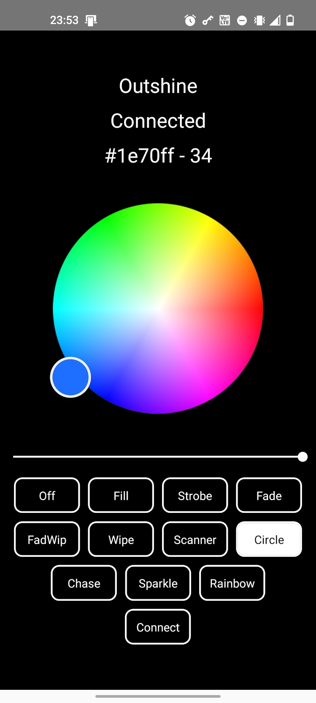
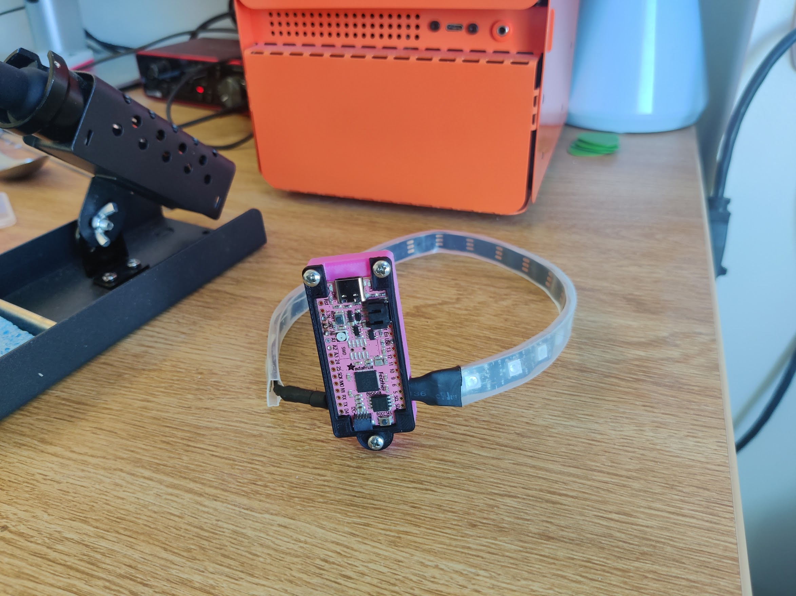
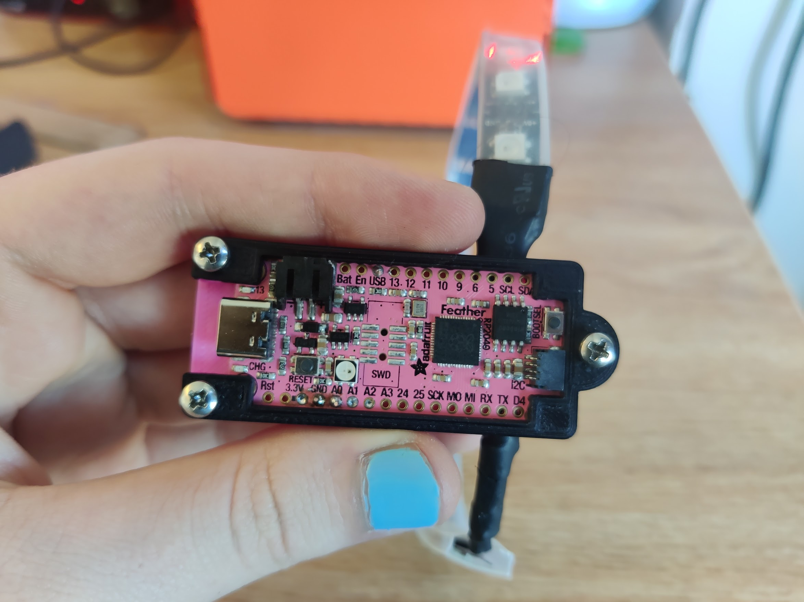

<Giphy id="WHmc9HI2lXWgnEgY7Y" />
<Caption>
  The choker, displaying a simple back-and-forth animation.
</Caption>

This project consists of three parts:

- [outshine](https://github.com/Breq16/outshine), an Arduino program that displays animations on a NeoPixel strand
- [OutshineApp](https://github.com/Breq16/OutshineApp), an Android app to communicate with an Arduino running Outshine via USB serial
- the rave choker, the physical device that I built which runs Outshine firmware

# Motivation

## Outshine

Outshine itself was based on some work I did for NU Rover, Northeastern University's team which competes in the Mars Society's University Rover Challenge. On the rover, LEDs are controlled by an ATmega328PB separate from the primary STM32 microcontroller. As such, to implement the NeoPixel handling, I essentially had free reign over this chip.

Functionally, the rover is required to display different colors to indicate its control mode (teleoperated or autonomous) and status about its autonomous navigation. It does not need to show animations, but I included them anyway because I figured they could be useful for displaying more detailed status information.

## Rave Choker

I got a ticket to a [Rezz](https://twitter.com/officialrezz) show, and I wanted to incorporate some flashy LEDs in my outfit somehow. Rezz is known for her LED glasses which display a spiral pattern. I wanted to create something similarly colorful and animated, but not a direct reimplementation of the glasses.

The process started with me standing in front of a mirror and holding a lit LED strip up to different parts of my body. Eventually, I settled on a choker, because I liked the look of it the best.

Originally, I had intended for the choker to be controlled via Wi-Fi by broadcasting its own network and exposing a server with a web UI. I had some familiarity with this architecture, as it's similar to how I built the [wall matrix](/projects/wallmatrix) project.

At the time, I had recently bought a limited-edition [pink RP2040 Feather](https://www.adafruit.com/product/5299) board from Adafruit, and I really wanted to use it for a project. This board doesn't have Wi-Fi or Bluetooth, so I figured I would add an additional Pi Zero to handle the networking.

With the added bulk of another board in mind, I decided to explore putting the boards and battery off of my neck and into a hat.



This worked to some extent, but the stretchiness of the hat didn't pair well with the fragile ribbon of the LED strip. In the end, I ditched the idea as I thought it seemed too fragile for extended use.

## OutshineApp

Going back to the drawing board, I decided to try leaving the Feather board on my neck and directly attaching it to my phone over USB. The phone would interface with the board over serial and provide power to it (removing the need for a dedicated battery).

I tried to use the [WebSerial API](https://developer.mozilla.org/en-US/docs/Web/API/Web_Serial_API) for this, but was hit with a really stupid issue involving Chrome on Android:

<Tweet id="1476122496319606787" />

As such, I switched to a native app. I built it in React Native, because I already had some familiarity with React.

# Technical Description

## Outshine

The Outshine firmware takes in commands over I2C or UART. Commands are four bytes long.

```
[1 byte] Red channel
[1 byte] Green channel
[1 byte] Blue channel
[1 byte] Animation command
```

I2C support was added for Rover, UART support was added for debugging the Rover but was later used for the rave choker.

The driver relies on one of two libraries, depending on the architecture:

- [Adafruit_NeoPixel](https://learn.adafruit.com/adafruit-neopixel-uberguide/arduino-library-installation) for ATmega Arduino boards
- [Adafruit_NeoPXL8](https://learn.adafruit.com/adafruit-neopxl8-featherwing-and-library/neopxl8-arduino-library) for the RP2040, to take advantage of the chip's [PIO](https://hackspace.raspberrypi.com/articles/what-is-programmable-i-o-on-raspberry-pi-pico) capabilities

The code is essentially a massive `switch`/`case` for the different animations. However, it keeps the state (LED index, frame index, etc) globally so that animations can transition smoothly into each other whenever possible.

## OutshineApp



The app is built in React Native, using [react-native-serialport](https://github.com/melihyarikkaya/react-native-serialport) to handle the USB serial communication. I'm just using off-the-shelf components for the color wheel, buttons, and brightness slider. I didn't even bother to build a production version; I just keep the development `.apk` on my phone.

## Rave Choker



The rave choker itself consists of a strand of NeoPixels connected to an Adafruit [Pink RP2040 Feather](https://www.adafruit.com/product/5299). I'm using a ["banana connector"](https://en.wikipedia.org/wiki/Banana_connector) as a clasp. It's wired to ground on both sides, so it's not electrically functional.



The body of the choker is housed in a 3D-printed case, made from two parts that screw together using threaded inserts. The case has an open top to show off the pink RP2040, because I think it looks cool.

# Results

It worked well at the Rezz show! In fact, a cute transfem noticed it, and we ended up talking and dancing together for most of the night :)

I had initially been worried about the battery life being an issue, but as long as the LEDs aren't solidly on full-white, it doesn't seem to be a huge problem.

I was also a bit worried about the "crowd-safety" of it--what if someone yanks on the cord?--but it came unplugged easily without yanking on my neck.

I also wore the choker to [GAY BASH'D](https://www.gaybashdboston.com/), a combination DJ set and drag show. I made a few revisions to the setup prior to this event, adding a brightness slider to OutshineApp and the 3D-printed case to the choker itself.

Overall, I think I really achieved the goal I started with. The choker is something flashy, stylish, and uniquely "me," and it stands out in the perfect way among a crowd at an EDM show. Also, the Outshine project will undoubtedly prove a useful starting point for future experimentation with NeoPixels.

Ending up with a tethered solution wasn't ideal (for instance, it made going through security a bit of a hassle), and a Bluetooth board would have been a more pragmatic choice. However, having the tether wasn't as annoying as I worried it would be.

It's also a bit cumbersome to change the animation, requiring me to unlock my phone and open the app. I only really wanted to change it every few songs, but it was still frustrating to have to stop raving to fiddle with a smartphone app. Physical controls would help remedy this, at the cost of more complexity. At the end of the day, I think the tradeoffs I made paid off.
