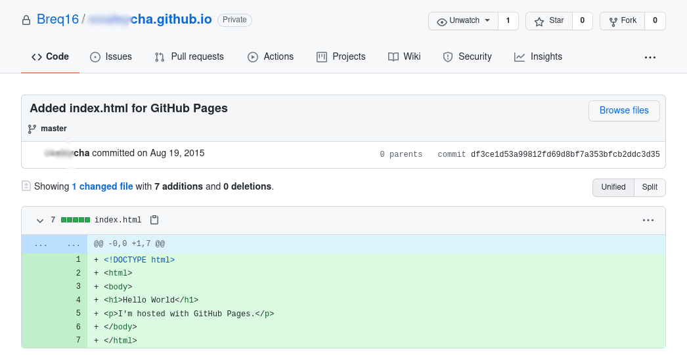
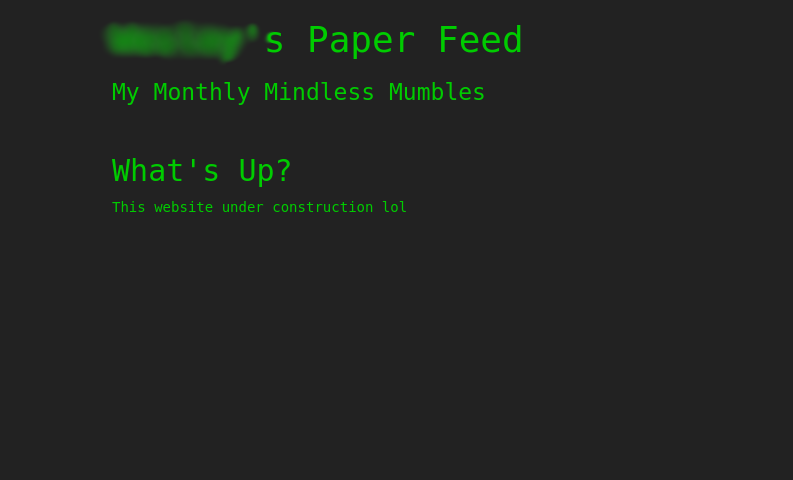
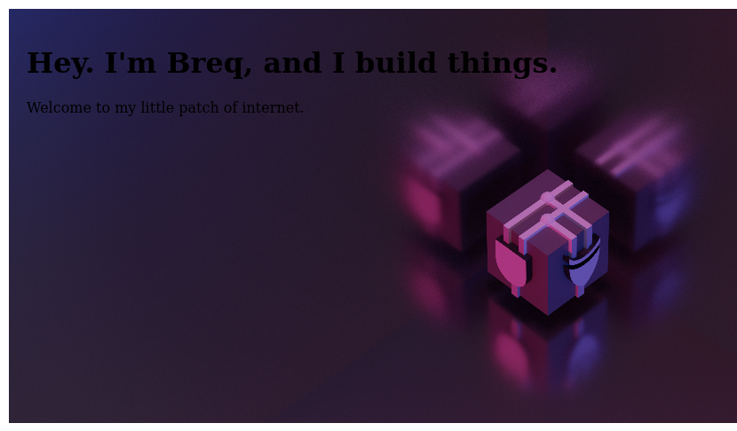
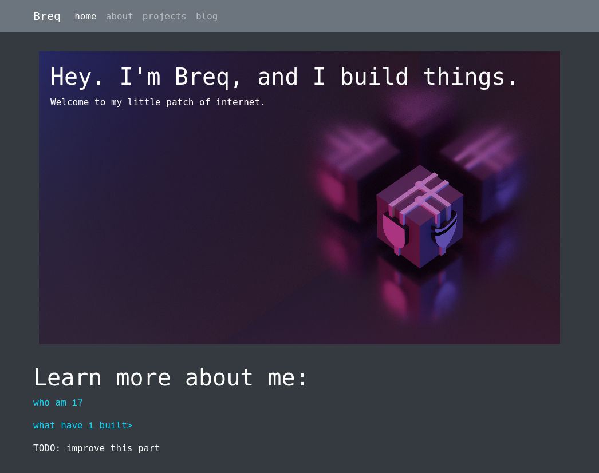
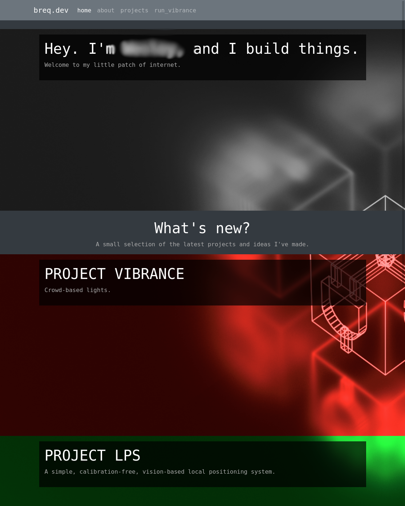
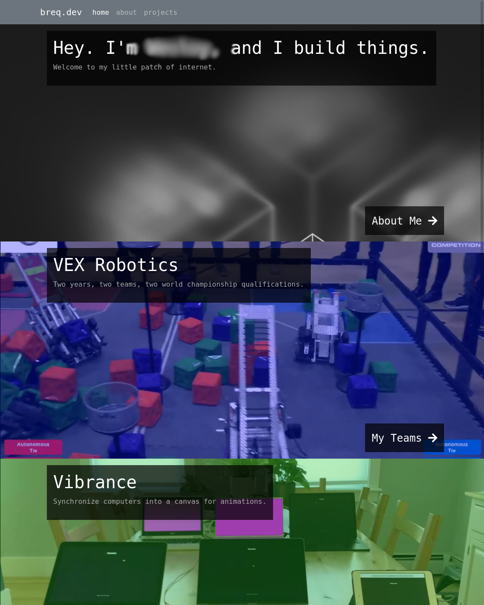
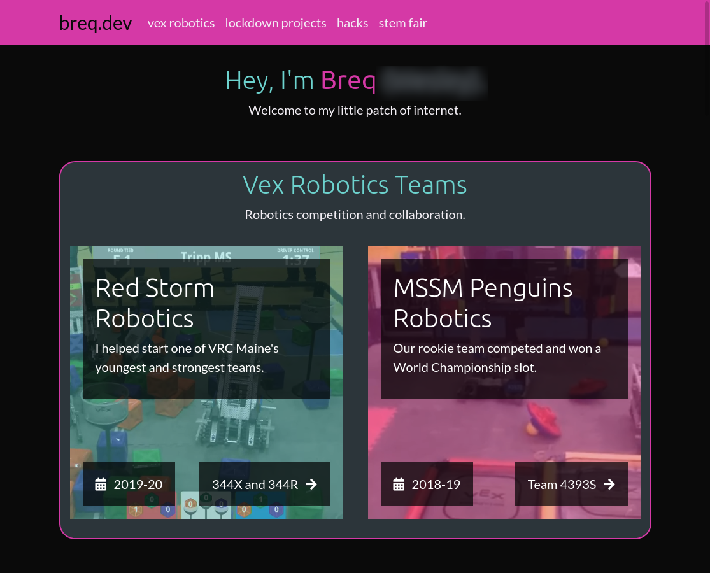
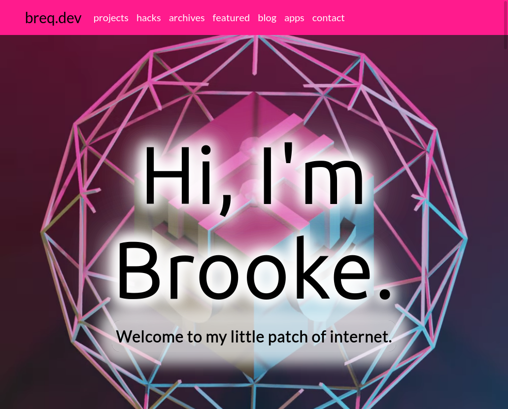
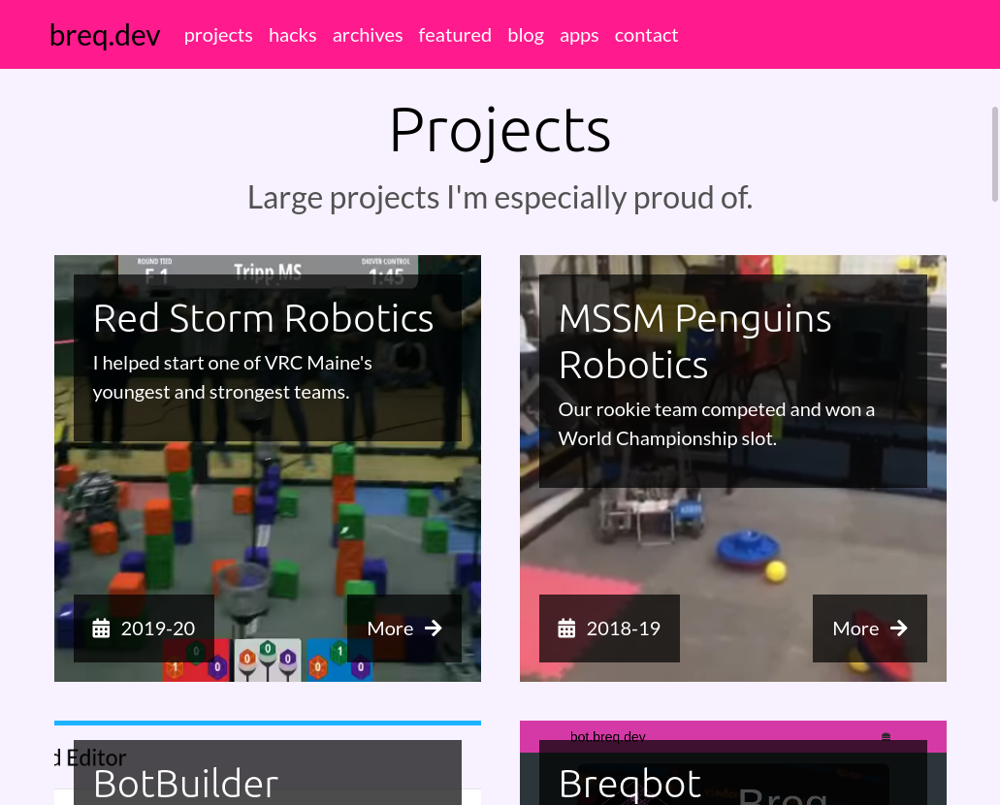

I've always wanted to keep a personal website up and running. In part, that's because I want to make sure everything I work on has a home; hopefully, people can use my project writeups for inspiration or advice on their own creative endeavours. It's also partly because I want a place to share my thoughts. The main reason, however, is to keep a centralized directory of who I am.

For much of my life, my identity has been, for lack of a better word, unstable. This is an outlet for me to keep track of what makes me who I am. It's a place where I can post things that I'm proud of.

(Funnily enough, it was this period of questioning that led me to pick the name `breq.dev`. At the time, I knew I was deeply uncomfortable with my name, but I didn't yet understand why. When it came time to pick a domain name, I ended up scrolling through the [AVR instruction set](https://en.wikipedia.org/wiki/Atmel_AVR_instruction_set) until I found something somewhat pronounceable, and it's kinda stuck!)

With that out of the way, here's the journey my online presence took from both a technical and personal perspective.

# My First HTML

The first HTML file I ever hosted publicly was published on August 19, 2015. Here's that fateful commit:

As a 12-year-old with no money, it's no surprise I turned to [GitHub Pages](https://pages.github.com/) for hosting. And, as you can tell from the commit, I hadn't exactly figured out code indentation yet.

Over the years, this site turned into a disorganized collection of random `.html` files I happened to experiment with. This included [Gemini](/projects/gemini) and [Bounce](/projects/bounce).

# The Paper Feed

In around 2019, I started to take this website idea a bit more seriously. I started what I called the Paper Feed -- a single-page site where I would post some thoughts every couple weeks. Here's the only surviving screenshot (which is probably for the best):

It wasn't much -- just a basic CSS theme. But it was mine, and it was the first time I started to see my online presence as something I should curate and something that people might be interested in.

# Jekyll, and the beginnings of the project log

Ouch. The lack of contrast hurts my eyes.

You can spot a few cool things in this revision though:
* No more deadnames to remove! Yay!
* My logo -- the cube with the half adder -- makes its first appearance.
* "Welcome to my little patch of internet" is still my website slogan to this day.

It didn't take long for me to start throwing more interesting stuff on that site, however:

I started to really use CSS for things at this point, as you can tell. This page was built with Bootstrap as a base. I also started to make use of Jekyll's layout features to reduce duplication across pages, and the data features to define the navbar with YAML.

The site had two pages: an "about" page listing my contact info, and a "projects" page containing writeups for all of the projects. Usability wasn't great -- the project page was a giant wall of text -- but those initial descriptions grew into the writeups I currently have on my site.

Next came the wireframe logo. Projects started to go into their own pages as well. Things were really starting to take shape.

I added autoplaying videos to bring my projects front and center.

As I started to accumulate more projects, I switched to a tile-based layout to fit more on the homepage.

# Spinning off `jekyll-theme-breq`

After this, I decided to spin off a Jekyll theme with my navbar style into a separate package. I'm still using this theme for my [emoji keyboard](https://emoji.breq.dev/).

Not much has changed really here -- I've switched to a light theme which is easier on the eyes, and I've added a big autoplaying video to the homepage. And, finally, I put the name "Brooke" in big letters! I gotta be honest, that felt good.

# Gatsby, and false starts

At this point, however, I was starting to feel like I'd reached the limits of what Jekyll could comfortably handle. Project information was split up between each project file and the YAML data files, and splitting off my theme into its own project hadn't made things simpler like I'd hoped.

I decided to make the switch to Gatsby. It was based on React, which I had heard about but wasn't too comfortable with initially. I was, however, impressed by its claims of legendary performance.

It took me a couple tries to make the switch. Gatsby's data layer took me forever to get used to. Thinking of each resource as a "node" and understanding how each step in the pipeline would process that node was a big shift in how I thought about content and data.

On my third or so attempt to learn Gatsby, I ended up with something feature-complete and decided to make the switch. And I'm glad I did -- I'm starting to really love React, and the image optimization, data prefetching, and simple hot reload that Gatsby brings to the table have made my final site much easier to develop and interact with.

I also switched to Tailwind for CSS around this time, and found it to be the perfect styling system for working with React components. Having CSS in a separate file, even with CSS modules, was something I always tried to find a way around. Tailwind, on the other hand, helps me stay organized.

# Where we are now

I think I've settled on a model that works, both in terms of my technology stack and in terms of the role this website serves in my life.

Preserving my work is important to me -- even if nobody else ever reads it, I want to have this here as a resource for myself, about myself, to remind me of who I am.
