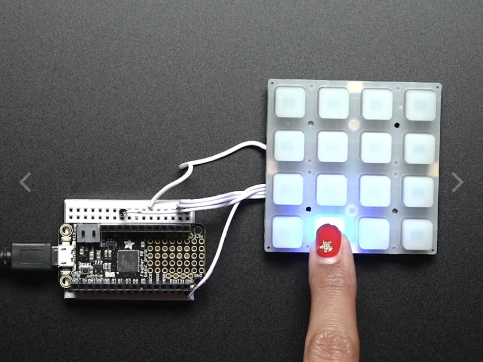
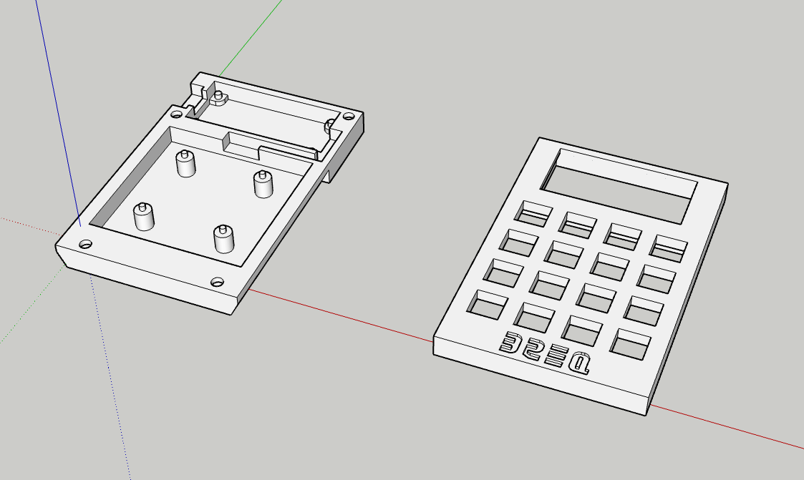
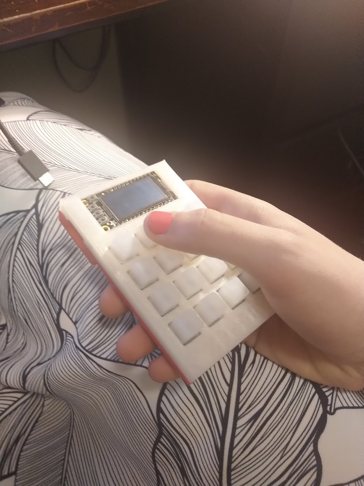

This is a story about a project I made that failed. By "failed," I don't mean just something that didn't perform well or didn't meet my expectations. What I mean is, I invested countless hours into this project and I have nothing to show for it. That is, nothing but a story.

_Did you come here looking for LVGL tips? Skip to [here](#sh1107)._

_Looking for source code? Here's my [CircuitPython work](https://github.com/Breq16/pockey) and my [RP2040 SDK work](https://github.com/Breq16/pocketdeck) on GitHub._

# The Premise

For years, I had been wanting to build a musical instrument using Adafruit's [NeoTrellis](https://www.adafruit.com/product/3954) kit. This board, combined with a silicone keypad, creates a surface of 16 buttons with individual RGB lighting.



<Caption>Picture from Adafruit demonstrating the NeoTrellis system.</Caption>

This arrangement reminded me of the [Novation Launchpad](https://novationmusic.com/en/launch/launchpad-x) with its arrangement of colorful buttons. I decided to try to make a similar USB MIDI controller.

I then had to decide which microcontroller to pick. At the time, the [RP2040](https://www.raspberrypi.org/documentation/rp2040/getting-started/) from Raspberry Pi was new, and I wanted to experiment with it. I eventually went with Adafruit's [RP2040 Feather](https://www.adafruit.com/product/4884), and I threw in an [SH1107-based display add-on](https://www.adafruit.com/product/4650) as an afterthought.

I called it "PocKey," both because it was a pocket keypad/keyboard, and because I like Pocky.

# Physical Construction

This, surprisingly, went pretty well. I mocked up a basic clamshell design in SketchUp...



Everything pretty much fit on the first try, except for a few issues with the Feather mounting holes:



<Caption>Sorry about the horrible picture quality, I got a new phone with a better camera about a month after I took this picture...</Caption>

With that out of the way, I turned to software.

# CircuitPython

I hadn't done much with [MicroPython](https://micropython.org/) before (or with [CircuitPython](https://circuitpython.org/), Adafruit's fork). I had used it a bit with the ESP8266, but hadn't had much success.

Thankfully, I had a much better experience this time around, at least at first. Adafruit publishes CircuitPython libraries for pretty much all of their boards, which really made throwing things together a lot easier. With the hardware interfacing abstracted away, I just had to focus on the application logic.

## Tangent: Hot-Reload

Here is where the scope of the project started to expand a bit. I decided it would be interesting to have multiple loadable "apps" on the device, such as a macro keyboard, MIDI controller, or even some simple games. While I was building out an app loader, CircuitPython's [hot reload](https://learn.adafruit.com/welcome-to-circuitpython/creating-and-editing-code#editing-code-2977443-18) functionality started to get in the way.

> To edit code, open the code.py file on your CIRCUITPY drive into your editor.
> Make the desired changes to your code. Save the file. That's it!
> Your code changes are run as soon as the file is done saving.

While this functionality makes things easy for most projects, it started to get in my way, since changing a single app would require reloading the entire project, losing any persistent state. I decided to work on my own "hot reload" functionality.

This supporting code ended up turning into a full-on operating system, handling display updates, button interrupts, and a ton of other functionality. But it did end up making apps easier to write. Here's a basic one I wrote that provides macro keys -- two keys on the main board, and an additional one on the display:

```python
import usb_hid
from adafruit_hid.keyboard import Keyboard
from adafruit_hid.keyboard_layout_us import KeyboardLayoutUS
from adafruit_hid.keycode import Keycode

from pockey.app import App

class KeyboardApp(App):
    def __init__(self, pockey):
        super().__init__(pockey)

        self.keyboard = Keyboard(usb_hid.devices)
        self.layout = KeyboardLayoutUS(self.keyboard)

        self.mapping = {
            0: "Hello World!",
            1: "https://google.com/\n",
            'A': "Hello hello!"
        }

    def setup(self):
        self.pockey.text.enabled = True

        self.pockey.text[0] = "Keyboard Demo"

        self.pockey.trellis[0] = (255, 255, 255)
        self.pockey.trellis[1] = (255, 255, 255)

    def handle_button(self, number, edge):
        if edge == self.pockey.PRESSED:
            if number in self.mapping:
                self.layout.write(self.mapping[number])

    def mainloop(self):
        pass

    def teardown(self):
        self.keyboard.release_all()

app = KeyboardApp
```

So far, things were going great! I did notice that the apps were starting to feel a bit sluggish, however...

## Unreasonable Defaults: Auto-Writes and Auto-Refreshes

The CircuitPython documentation makes it clear that CircuitPython is intended primarily as an educational tool.

> The easiest way to program microcontrollers:
> CircuitPython is a programming language designed to simplify experimenting and learning to code on low-cost microcontroller boards.

Going into this, I wasn't expecting CircuitPython to be the highest-performance library out there by any means. That said, I was still surprised with the amount of tweaking I needed to do just to get a halfway acceptable level of performance.

CircuitPython, by default, will immediately write any updates to NeoPixel strands or graphical displays. Admittedly, this makes things a bit easier to get started with--when I was just starting out with embedded software, I always forgot to call `display.show()` to push updates to the screen, and I would sit there and wonder why nothing was happening.

That said, this approach makes performance much worse. The reason for this is straightforward: generally, multiple things are drawn on the screen at a time, and doing a refresh for each one of these things will be a lot slower than just doing a single refresh at the end.

Fortunately, this behavior was simple enough to disable by setting `trellis.pixels.auto_write = False` and passing `auto_refresh=False` to the `adafruit_displayio_sh1107.SH1107()` constructor.

## Update diffing and other trickery

At this point, I was still having trouble with performance. I decided to try to reduce unnecessary updates further by calculating the difference between the new and old state. Here's how I did that with the NeoPixels:

```python
def sync(self):
    self.trellis.sync()

    virtual = self.virtual
    actual = self.actual

    dirty = False

    for pixel in range(16):
        if virtual[pixel] != actual[pixel]:
            self.trellis.pixels[pixel] = virtual[pixel]
            actual[pixel] = virtual[pixel]
            dirty = True

    if dirty:
        self.trellis.pixels.show()
```

I did some similar processing of the display output by tracking the text that was on the screen. While this did significantly improve performance, it still wasn't up to the level I wanted.

As an aside: You might notice, in this code snippet, I used the lines `virtual = self.virtual` and `actual = self.actual`. That was yet another attempt at optimization. The rationale behind this was from [this article by Uri Shaked](https://urish.medium.com/embedded-python-cranking-performance-knob-up-to-eleven-df31a5940a63#a719), which explains that caching references from `self` can improve performance.

## Calling it quits

At this point, the "button-press-to-MIDI-note" latency was inconsistent and higher than I would consider acceptable. I had an application that had exploded in complexity, no good way to profile it, and no clear path to better optimization other than approaches that bordered on [cargo cult programming](https://en.wikipedia.org/wiki/Cargo_cult_programming). Without a clear path forward, I decided to give up on CircuitPython.

So... what to do now? The RP2040 didn't have well-documented Arduino support at the time ([this guide](https://learn.adafruit.com/rp2040-arduino-with-the-earlephilhower-core) wasn't published until this June). I decided to try out the [RP2040 SDK](https://github.com/raspberrypi/pico-sdk) from the Pi Foundation. I'm not super familiar with C++ and its toolchains, but how hard could it be?

# The RP2040 SDK

The RP2040 SDK comes with great libraries... for the RP2040's own peripherals, that is. At the time, the chip was so new that I couldn't find compatible libraries for the NeoTrellis or the SH1107. So, I decided to try to roll my own.

## Adafruit Seesaw

The NeoTrellis is based on a protocol that Adafruit created for I/O expansion devices called Seesaw. The protocol is built on I²C, and it is based off of multiple _modules_, each with its own _functions_. For instance, the NeoPixel module (which controls the RGB lighting in each key) is module number `0x0E`. Setting a given pixel value is function number `0x04`. There are some precise timing requirements with the protocol, but in general, it's just about doing an I²C write to the Seesaw's address, and setting the payload to the module and function numbers followed by any additional arguments. To read data from the Seesaw, it just takes an immediate I²C read afterward.

I wrote a Seesaw driver in C++, which made writing to NeoPixels was as easy as this:

```cpp
void NeoPixel::set(uint16_t number, uint8_t r, uint8_t g, uint8_t b) {
    number *= 3; // each pixel is 3 bytes in the buffer

    uint8_t data[] = {(uint8_t)(number >> 8), (uint8_t)(number & 0xff), g, r, b};

    seesaw.write(
        MODULE_BASE,
        BUF,
        data,
        5
    );
}

void NeoPixel::show() {
    seesaw.write(
        MODULE_BASE,
        SHOW,
        nullptr,
        0
    );
}
```

Reading data from the keypad was similarly just a set of Seesaw commands.

With this out of the way, I was feeling pretty optimistic. Sure, I had to write my own library implementing the protocol, but at least I got something working! This is when things started to take a turn...

## SH1107

Adafruit links a [datasheet](https://cdn-shop.adafruit.com/product-files/4650/4650_C14586.pdf) with information about the display. However, it includes almost no information other than the I²C messages to send for the OLED startup procedure. It doesn't even list the available I²C commands. And, parts of it are written in Chinese with either no English translation or an incomprehensible attempt at one. I ended up basing my implementation mostly off of another datasheet I found [here](https://www.displayfuture.com/Display/datasheet/controller/SH1107.pdf), as well as using Adafruit's CircuitPython SH1107 library as a reference.

The SH1107 framebuffer mapping is somewhat unconventional compared to other hobbyist displays. Most displays allocate one or more bytes per pixel, but the SH1107 only uses one _bit_ per pixel, since it is a monochrome screen.


## LVGL

Now that I understood the SH1107 mapping, I needed a library that could draw simple shapes and text onto the screen. A popular option I found was LVGL. I had been wanting to try LVGL for a long time, mostly because it's the default graphics library for [PROS](https://pros.cs.purdue.edu/).

I got to work porting LVGL to the SH1107, and I immediately noticed that it was going to take some trickery to get LVGL to play nice with this weird pixel mapping. Thankfully, LVGL provides a few callbacks that can be customized:

| LVGL Display Driver Callback | Description                                                                               |
| ---------------------------- | ----------------------------------------------------------------------------------------- |
| `flush_cb`                   | Callback to flush the display buffer data to the display hardware                         |
| `rounder_cb`                 | Callback to broaden the update area if necessary to ensure it lines up with display pages |
| `set_px_cb`                  | Callback to set a specific pixel value within the display buffer                          |

I got to work on my implementations.

### `rounder_cb`

This one is the most straightforward. All I needed to do was ensure that the X coordinates of the update area lined up with the page boundaries (every 8 pixels).

Within a page, all the pixels in any row are stored in the same byte. Therefore, if we want to update part of the display, we need to ensure that the area we're updating is aligned to the page boundaries, since we can't update individual bits.


<Caption>In this diagram, each vertical black line represents a boundary between two pages. The original update area, shown in red, is extended to line up with the page boundaries.</Caption>

I started by rounding the first coordinate down to the nearest multiple of 8 by masking off the last three bits. Then, I did the same for the second coordinate, adding 7 to bring it to the end of the page.

```cpp
void Display::round(lv_disp_drv_t* disp_drv, lv_area_t* area) {
    area->x1 = area->x1 & ~0x7;
    area->x2 = (area->x2 & ~0x7) + 7;
}
```

### `set_px_cb`

Next, I took on the callback for setting pixel values.

I started by calculating the page, column, and bit of the given pixel. Then came the tricky part--I found the number of bytes per page. LVGL sometimes only updates part of the display at a time, so it might decide to only update half of the display.

Finally, I found the offset into the buffer, and used a mask to flip the bit.

```cpp
void Display::set_pixel(lv_disp_drv_t* disp_drv, uint8_t* buf, lv_coord_t buf_w, lv_coord_t x, lv_coord_t y, lv_color_t color, lv_opa_t opa) {
    uint16_t page = x >> 3;
    uint16_t column = y;
    uint8_t bit = x & 0x7;

    uint8_t mask = 1 << bit;

    uint16_t bytes_per_page = disp_buf.area.y2 - disp_buf.area.y1 + 1;

    uint16_t buffer_index = (page * bytes_per_page) + column;

    if (color.full == 0) {
        buf[buffer_index] |= mask;
    } else {
        buf[buffer_index] &= ~mask;
    }
}
```

### `flush_cb`

One more. For this one, I found the starting page, ending page, starting column, and number of bytes per page. I then iterated through each page.

For each page, I set the display page address to the current page, then set the column address to the starting column (since there are more than 16 columns, this is split into 2 commands, one for the high bits and one for the low bits). Finally, I found the index into the buffer, and sent the number of bytes per page.

```cpp
void Display::flush(lv_disp_drv_t* disp_drv, const lv_area_t* area, lv_color_t* color_p) {
    uint8_t start_page = area->x1 >> 3;
    uint8_t end_page = area->x2 >> 3;

    uint8_t start_col = area->y1;
    uint8_t end_col = area->y2 + 1;

    uint8_t start_col_high = (start_col >> 4) & 0x7;
    uint8_t start_col_low = start_col & 0xF;

    uint8_t bytes_per_page = end_col - start_col;

    uint8_t* color_buffer = reinterpret_cast<uint8_t*>(color_p);
    for (uint8_t page_offset = 0; start_page + page_offset <= end_page; ++page_offset) {
        send_command(PAGE_ADDR | start_page + page_offset);

        send_command(COL_ADDR_LOW | start_col_low);
        send_command(COL_ADDR_HIGH | start_col_high);

        uint16_t buffer_index = page_offset * bytes_per_page;
        uint8_t* data = color_buffer + buffer_index;

        send_data(data, bytes_per_page);
    }

    lv_disp_flush_ready(disp_drv);
}
```

I write these as if this was a straightforward process. In reality, getting these callbacks right took me about a week of trial and error. I spent so long troubleshooting edge cases that only occurred for specific update area sizes, and struggling to understand how the addressing of the SH1107 worked to begin with. But finally, I had a working display driver. Now, all I needed was the USB functionality to send keystrokes or MIDI input to the computer.

## TinyUSB

The RP2040 SDK includes TinyUSB as a high-level USB library. The Pi Foundation provides no documentation for this library. The TinyUSB docs say that...

> It is relatively simple to incorporate tinyusb into your (existing) project

...but they provide almost no documentation. Seriously, what is "Implement all enabled classes's [sic] callbacks"??? What classes are enabled? What classes should I enable? What callbacks do they have? What does my implementation need to include???

It is at this point where I gave up on this project.

# Conclusion

Well, this is it. I'm faced with a project I spent countless hours on, without anything to show for it. So what did I learn?

**Introducing abstractions for short-term speedup can lead to technical debt in the long run.** By trying to optimize the CircuitPython build as much as possible, I introduced complexity that left me with an application that was harder to understand. Without clear knowledge as to what my code was doing, I was left without any clear way to improve it.

**The flashiest solution isn't always the best.** If I had picked a chip with stable Arduino support, I could've taken advantage of existing libraries while keeping the speed of C++. Choosing the brand new RP2040 put me on the bleeding edge.

**Pick the right tool for the job.** Python, on a microcontroller, for a latency-critical application... Even though CircuitPython let me get up and running quickly, it couldn't achieve what I was targeting, forcing me to rewrite everything from scratch in C++.

**Fail early.** One of the main dealbreakers of the project was that the keypad buttons didn't respond well to "drumming" input--they needed to be completely pressed down. Instead of recognizing this flaw in the design, I kept investing effort into the project anyway.

**Focus on the MVP.** In the early stages, I invested a lot of time in building out the app-specific hot reload feature. If I had only focused on the core MIDI functionality, I would have faced the latency and usability issues a lot sooner. By worrying about side features instead of the minimum viable product, I was delaying the inevitable.

## Epilogue

Ironically, two weeks after I gave up on this project, Adafruit released an extremely similar design [as a kit](https://www.adafruit.com/product/5128), trading the three buttons for an encoder and the silicone keypad for Cherry MX (clone) switches.

I'm not disappointed in myself for how this project went. I learned more about bit operations in embedded programming, the mechanics of I²C, and the tooling required to manage a large C++ project. I also learned some important lessons about project management and planning. I'm glad I'm experiencing failure like this now, when the only casualty is a bit of my spare time.

Oh, and when I said I had nothing to show... that isn't _entirely_ true.

<YouTube id="4HvcbrAWKGY" />
