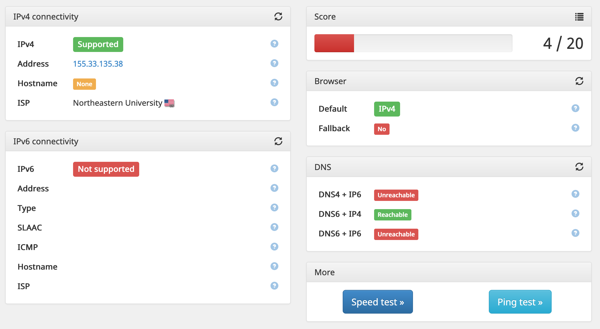
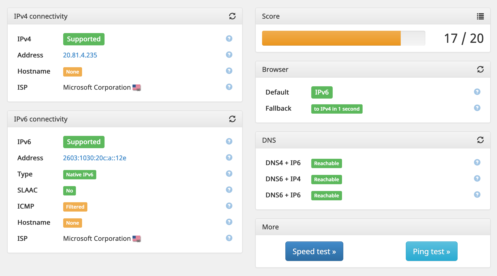

Northeastern's dorms have good WiFi... for most people. The speed is excellent, the coverage is great, and I have yet to encounter any content blocking. That said, for a tinkerer like me, I had some concerns.

# Client Isolation

By default, the Northeastern network isolates devices from each other. On the surface, this is a pretty smart thing to do. It's great that my computer isn't directly accessible from every other machine on campus.

That said, it can be quite a headache to work around sometimes. For my [wall mounted matrix display](/projects/wallmatrix) project, when I was at home, I would connect to it by typing `http://matrix.local/` into my browser, and [mDNS](https://en.wikipedia.org/wiki/Multicast_DNS) would do its thing, connecting me directly to the display.

Obviously, with client isolation, that wasn't going to work.

In a previous post, I wrote about the [Wireguard server](/2021/02/10/dokku#wireguard) that I run for myself. After setting up a Wireguard client on the matrix, I was able to access it from any of my other devices, provided I remember to turn the VPN on.

# Hey, if I have a VPN, can't I run IPv6 through it?

Northeastern's WiFi doesn't natively support IPv6. I want to have access to an IPv6 network, so that I can test the IPv6 functionality of my websites.



<Caption>Nope. No IPv6 support here.</Caption>

So, my next question was: could I route IPv6 through my VPN?

## Getting IPv6 to Microsoft Azure

When I first set up my Dokku machine, IPv6 wasn't available for VMs. It wasn't released until [April 2020](https://azure.microsoft.com/en-us/updates/ipv6-for-azure-virtual-network-is-now-generally-available-2/). Ugh.

This [ServerFault answer](https://serverfault.com/questions/1014465/adding-a-public-ipv6-address-to-a-linux-vm-in-azure) helped me figure it out, but basically, I needed to attach a completely new virtual NIC to the machine. Which meant a reboot... which meant downtime... which sucks, but it's kind of inevitable, since I'm hosting so many services on just one machine. (What can I say--as much as I'd love my own redundant Kubernetes cluster, that stuff's _expensive_ to run.)

After changing the VM settings, NIC settings, VLAN settings, and VLAN subnet settings in the Azure portal, I was finally able to access the IPv6 internet from my Azure VM with its new IPv6 address.

...its single IPv6 address.

Yep, instead of assigning a /64 to my machine, Microsoft gave me just a single address.

## Fine, I'll NAT it

The whole point of IPv6 was to increase the available address space, removing the need for one-to-many network address translation (NAT). With IPv4, there are only enough IP addresses to give each household or small office a single address to share between all devices. Although larger businesses can get larger blocks, they still need to share. NAT allows this sharing to take place.

IPv6 was _supposed_ to remove this requirement entirely. Each subnet _should_ be a `/64`, giving plenty of potential addresses to any connected clients. Then, end-users _should_ get blocks of `/56` so that they can create separate subnets as needed.

But, unfortunately, we don't live in that reality, so I had to resort to NAT.

## Docker

Docker can be configured to support IPv6 by editing the `/etc/docker/daemon.json` file:

```json
{
    "ipv6": true,
    "fixed-cidr-v6": "fd16:42d4:7eff::/80"
}
```

`fixed-cidr-v6` is _supposed_ to be the public IPv6 range to assign to Docker containers. However, since I don't have a range of addresses, I'm using a [Unique Local Address](https://en.wikipedia.org/wiki/Unique_local_address), or ULA, range instead. The `42d4:73ff` part was randomly generated to reduce the chance of collision.

Next, I needed to configure Docker to NAT this ULA range instead of trying to route it directly to the Internet. I found some code (ironically itself distributed as a Docker container) that sets up this NAT: `robbertkl`'s [docker-ipv6nat](https://github.com/robbertkl/docker-ipv6nat).

> I'm aware NAT on IPv6 is almost always a no-go, since the huge number of available addresses removes the need for it. [...] I'm in no way "pro IPv6 NAT" in the general case; I'm just "pro working shit".

At least the repo is clear about being an ugly hack. It was easy enough to deploy to Dokku with `docker-options add deploy --privileged --network host -v /var/run/docker.sock:/var/run/docker.sock:ro -v /lib/modules:/lib/modules:ro --restart=on-failure:10`.

## Wireguard Server

Now, I could access the IPv6 Internet from the Wireguard container itself, but I needed to expose this to the clients. I decided to just add another NAT so that I didn't interfere with how Docker keeps track of container IPs.

For this subnet, I chose a ULA prefix of `fd16:4252:4551::/64`, because I wanted something memorable, and `0x42 0x52 0x45 0x51` is the ASCII for "BREQ". It might not be RFC compliant, but at least it's cool.

I started by adding `--sysctl=net.ipv6.conf.all.forwarding=1` to the docker options for the Wireguard container. I then added some additional `iptables` rules for the IPv6 traffic. Honestly, I'm no expert with iptables, so I just copied the default `iptables` rules but changed the command to `ip6tables`.

| Rule                                                    | Explanation                                                    |
| ------------------------------------------------------- | -------------------------------------------------------------- |
| `ip6tables -A FORWARD -i %i -j ACCEPT`                  | Forward all traffic inbound to the Wireguard interface (`wg0`) |
| `ip6tables -A FORWARD -o %i -j ACCEPT`                  | Forward all outbound traffic from `wg0`                        |
| `ip6tables -t nat -A POSTROUTING -o eth0 -j MASQUERADE` | Apply many-to-one NAT to traffic exiting the container         |

## Wireguard Peers

For every peer on the network, I needed to assign an IPv6 address on the subnet. The server became `fd16:4252:4551::1`, my desktop was `fd16:4252:4551::2`, and so on. I then added `AllowedIPs=::/0` to each peer so that it routed all IPv6 traffic over the VPN.

## Results

It's a pretty janky IPv6 implementation, especially since it has _two layers of NAT_ when IPv6 wasn't meant to be used with NAT at all, but it works!



As a side effect, after adding an `AAAA` record to my DNS provider, all of my API services are now available over IPv6 as well. That means `cards.api.breq.dev`, `botbuilder.api.breq.dev`, etc, are all dual-stack all the way.

This was a lot of effort for, well, not a lot of importance. That said, I'm glad that I got to experience some of the issues with upgrading a complex network to IPv6. In many ways, it's a completely different mindset--under a well-thought-out IPv6 system, you want to make sure each node that _might have a subnet behind it at some point_ has its own `/64` to play with. Services like Docker and cloud providers built out their infrastructure without considering this, and in the process of patching IPv6 support in, they didn't adhere to these best practices, leading to struggles downstream.
