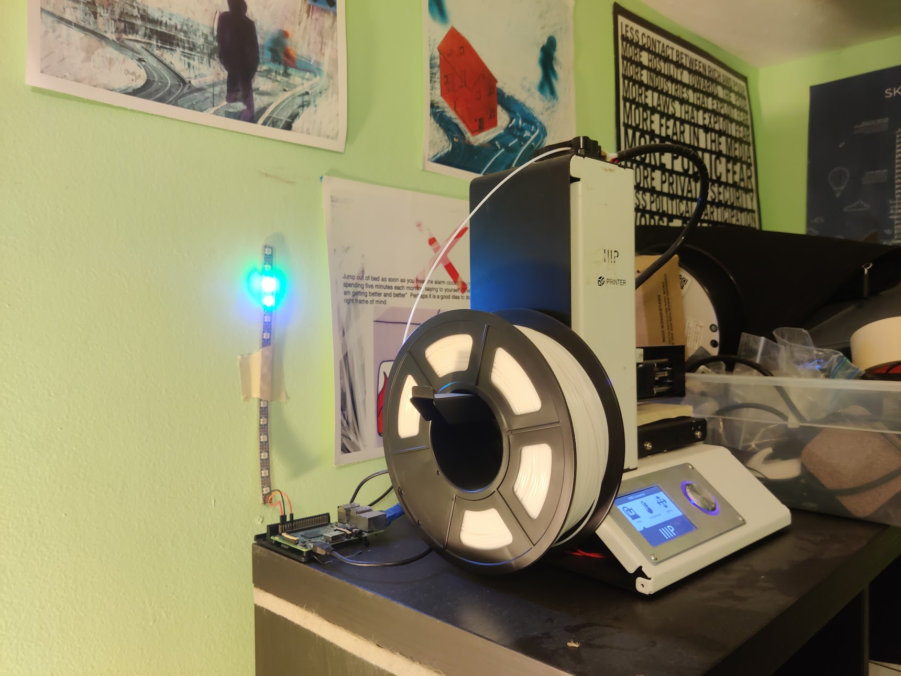

<Caption>NeoPixels never look good on camera.</Caption>

# Overview

This is a small indicator light strip that I mounted next to my 3D printer.
It indicates if the printer is ready, printing, or in an error state.

# Motivation

In June 2021, I started a summer job in the Texas Instruments semiconductor
fab in South Portland. There were a lot of different machines in the fab, but
they all had one standardized light tower design. This helped me learn how to
operate them more quickly, transfer my knowledge between different areas, and
understand the status of a machine at a glance.

I noticed that the indicators shown for a fab machine (load, unload,
error) were similar to those I might want to show for a 3D printer. So, I set
about building my own "light tower" to attach to my 3D printer.

# Technical Description

I used Adafruit's NeoPixel library to write a Python script that changes the
status displayed on the light tower. However, this script needs to run as root,
since Adafruit's library uses DMA (direct memory access) to control the Pi's
PWM module.

I then wrote an Octoprint plugin that handles printer events. I used the
[EventHandlerPlugin mixin](https://docs.octoprint.org/en/master/plugins/mixins.html#eventhandlerplugin)
to write a basic Python script that called the NeoPixel script when necessary.

Here is when an issue arose: Octoprint runs with a user account, but the
NeoPixel script needs to run as root. I needed some way to allow the Octoprint
user account to execute a program as the root user.

I decided to use the Unix "setuid" system to allow the Octoprint user to
invoke the NeoPixel script with the permissions of the root user. Since setuid
can't be used for scripts, I wrote a wrapper function to pass along the
arguments and run the NeoPixel script as root.

```c
#include <string.h>
#include <stdio.h>
#include <stdlib.h>
#include <sys/types.h>
#include <unistd.h>

int main(int argc, char* argv[]) {
    setuid(0);
    argv[0] = "./tower.py";
    execv("./tower.py", argv);
    return 0;
}
```


With this in place, the chain of Octoprint -> Plugin -> Setuid Wrapper -> NeoPixel Script -> NeoPixels
worked perfectly.

# Results

Generally, none of my projects have required an understanding of Linux permissions
and libc functions like `setuid` and `exec`. A lot of my knowledge in this area
was built up by watching [LiveOverflow](https://www.youtube.com/channel/UClcE-kVhqyiHCcjYwcpfj9w).
It was really fun to finally actually put some of this knowledge to use, and
writing a `setuid` program myself helped me better understand some of the security
issues involved and the other specifics of this system.