<YouTube id="4wxjDMXGJJ0" />

<Caption>
A quick demonstration of the system in action.
</Caption>

# Overview

_The following is adapted from [this document](https://docs.google.com/document/d/1GBooxXnvndxPmWwFXSiqQRPsxmN0NLmFtbzJHfWmCzk/edit?usp=sharing) that I initially wrote describing the system._

The LPS (Local Positioning System) is a system to help robots determine their location in a predefined area. This system uses a camera and colored markers to determine the position of robots and other objects in a scene, then relays that information to robots over a network connection.

# Motivation

Localization in robotics is a difficult but important problem. Through the Vex Robotics Competition, I’ve had experience trying to get a robot to perform pre-programmed movements. I’ve also worked on several automated robots outside of VRC. In all cases, I’ve been dissatisfied with the poor options available for determining a robot’s position.

## Current Systems

### Accelerometer

Because an accelerometer measures acceleration, it must be double-integrated to track the robot’s position. This means that any error will drastically affect the result over time, and the calculated position will rapidly lose precision.

### Encoder Wheels

By placing encoders on wheels, a robot can track its movement over time. VRC team 5225A, “πlons,” used a technique with three separate encoders to track the robot’s movement, its slip sideways, and its orientation (described here). However, any error (wheel slop, robot getting bumped or tipping, etc) will accumulate over time with this method. πlons needed to supplement their tracking system by occasionally driving into the corners of the VRC field in order to reset the accumulated error.

### Global Positioning System

GPS can work well for tracking a robot’s general position in a large area. However, common receivers have an accuracy of only about 3 meters, and while modules with centimeter-level accuracy are available, they are prohibitively expensive.

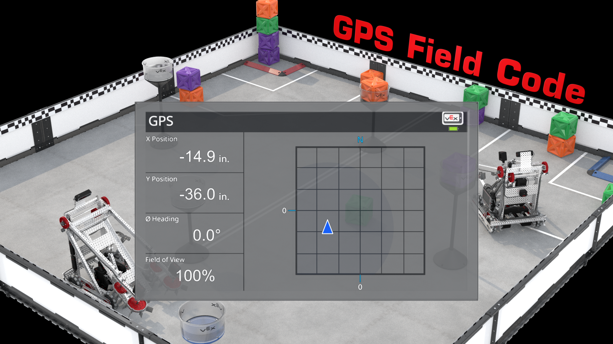

<Caption>
The "Vex GPS": An example of the "Pattern Wall" approach to localization.
</Caption>

### Pattern Wall

By placing a specific code along the walls of the area, a camera mounted on a robot can determine its position and orientation. This method will be used in the Vex AI Competition. Other objects in the field can block the robot’s view of the pattern wall. Additionally, this system requires a defined playing field with straight sides and walls, and each robot is required to have its own camera and computer vision processing onboard.

### LiDAR

A LiDAR sensor can create a point cloud of a robot’s surroundings, and SLAM (Simultaneous Localization And Mapping) algorithms can automatically map an area and determine the robot’s position relative to other objects. However, LiDAR sensors are large and expensive, they must be mounted with a clear view of the robot’s surroundings, and the robot must have enough processing power to run these algorithms. Additionally, this system will not work as well in an open environment, where there won’t be any objects for the LiDAR to detect, and it might have difficulty determining the difference between stationary objects (such as walls) and moving objects (such as other robots in the area).

### Radio trilateration

If a robot is able to determine the relative signal strength of multiple different radios (such as WiFi access points or Bluetooth beacons), and it knows the positions of these radios, it can estimate its position relative to them by assuming signal strength correlates with distance. Because there are many other variables that affect signal strength, such as objects between the robot and radio, this method is not very reliable. Also, robots that use wireless communication will need to make sure their transmissions do not affect their ability to determine their location. This problem is worse if multiple robots are present in an area.

## New System

In the past, I have more or less given up on systems which do not accumulate error and instead programmed the robot to navigate using an open-loop system and then drive into a wall (of known position) every so often. As this solution doesn’t work well outside of a clearly-defined environment, I wanted to see if I could come up with a better solution for localization.

I set the following criteria for such a system:

-   Work well in scenarios where multiple robots are present
-   Not require complex processing on each robot
-   Be simple to set up in a given area (not requiring calibration)
-   Be relatively inexpensive and use commonly available parts
-   Not accumulate error over time

I decided to primarily target a scenario with multiple tracked objects in a single area. Putting the heavy processing outside of the robot allows for more inexpensive robots powered by basic microcontrollers. Additionally, this allows passive objects in the scene to be tracked, allowing robots to interact with them.

I decided to try implementing a solution that worked outside the plane that the robots would be in, so that it would not be affected by adding more robots or objects into the area. Cameras are common and relatively cheap, so using a camera mounted on a tripod and pointed down at robots seemed like the best approach.

# Technical Description

## 1. Image Scanning

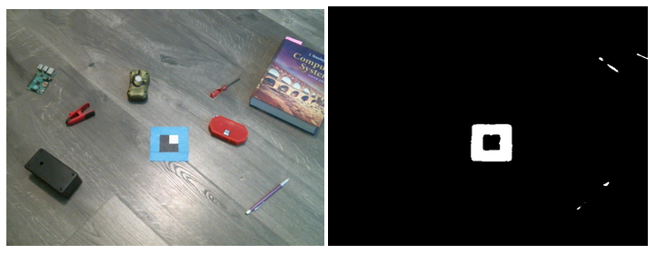

The system starts with a picture of the scene (left image). I’ve placed a computer vision marker in the scene along with a bunch of random objects.

Markers have a blue border around them to distinguish them from the environment. I used painters’ tape for this, as it has a consistent hue in a variety of lighting conditions. The system selects all the pixels in the image with this hue (and ample lightness and saturation).

This mask is shown in the right image. The marker is plainly visible here, and almost all of the other objects in the scene have been filtered out. The pencil and textbook happen to have the same hue, but they will be filtered out later.

The first step in handling the masked areas is to determine their boundary. OpenCV has a convenient function for tracing the border of each region of interest.

Now, we have a series of points tracing the boundary of the marker. This isn’t a perfect quadrilateral for a variety of reasons (the camera introduces noise to the image, the lens introduces distortion, the marker isn’t completely square, the image resolution is low so the image is a bit blurry, etc). To approximate this boundary to four points, with one at each corner, we can use the Douglas-Peucker algorithm (conveniently also implemented by OpenCV).

We can also do some filtering here to discard areas that aren’t markers. For instance, areas that are very elongated, aren’t quadrilaterals, or are very small probably aren’t valid markers. This leaves us with the marker in the image, surrounded by a red bounding box.

## 2. Transformation Calculation

The next step is to figure out what type of marker this is, and what its orientation is. Because there might be multiple markers in a scene, the black and white squares on the inside of the blue border give information on what type of marker it is.

Using the bounding quadrilateral of the marker, we can calculate where we expect the squares to be. To do this, we need to calculate the transformation between the basis of the picture (i.e., with the origin at the top-left pixel, x-axis as the top row of pixels, and y-axis as the left row of pixels) and the basis of the scene. For reading the squares, it’s convenient to set the origin of the scene at the center of the marker, choose x and y axes arbitrarily, and set the length of each square to 1 unit.

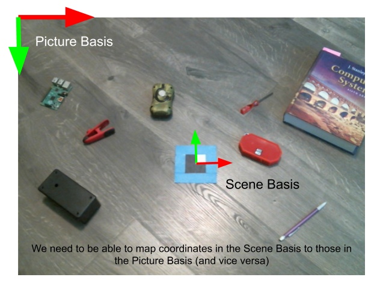

It’s apparent that the sides of the marker aren’t parallel lines in the image, even though they are parallel in real life. Because the camera is a perspective camera, we need to use a perspective transformation (in which parallelism isn’t preserved). In order to calculate this type of transformation, we need to know the coordinates of four points in each basis. Conveniently, our quadrilateral bounding the marker has four points which we know the image coordinates of, and we know the real-life position of the marker’s corners relative to its center as well.

In order to compute a perspective transformation, we need a new coordinate system. Consider a point which appears on the horizon: it would be mapped an infinitely far distance away. Representing this isn’t possible with only X and Y coordinates, so we need a third coordinate.

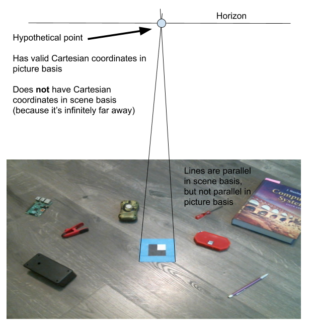

The solution is a system known as homogeneous coordinates. To map our existing cartesian coordinates to homogeneous ones, we just include a 1 as the third coordinate. To map them back to cartesian coordinates, divide the X and Y coordinates by the third coordinate. This solves our horizon-point problem: Points with a third coordinate of 0 will have no defined equivalent cartesian coordinate.

(While the system is operating normally, points on the horizon line shouldn’t ever actually be visible. Despite this, we still need to consider it in order to define the perspective transformation.)

Using our new homogenous coordinates, we can calculate a transformation matrix which transforms coordinates in the picture to coordinates in real life (and invert that matrix to go the other way).

## 3. Marker Identification

Because we know the real-life coordinates of the corners of each square, we can use the transformation matrix to map them to coordinates of pixels in the picture. The yellow grid in the image shows where the squares are expected to be.

At least one square is guaranteed to be each color. In order to compensate for varying lighting conditions, the system identifies the darkest and lightest squares, and then compares the lightness of the other squares to determine if they are colored black or white. On the left of the image, the grey square is the average lightness of the darkest square on the marker, and the white square is the average lightness of the lightest square on the marker.

No pattern of squares is rotationally symmetrical, so the orientation of the pattern can be used to determine the orientation of the marker. The system can now draw the position and orientation of the marker over the camera feed.

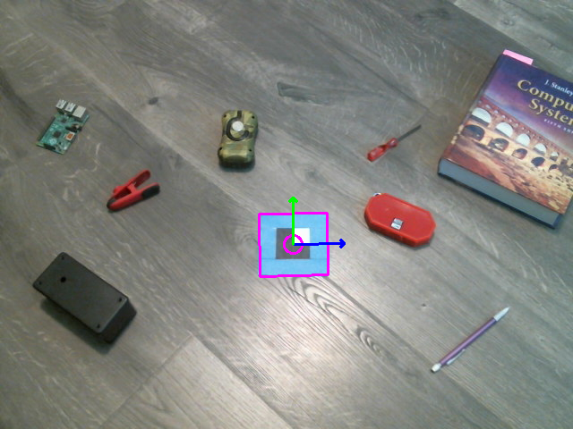

## 4. Global Reference

I’ve added a few new markers into the scene. These markers have a different code on them: one black square and three white squares. I’ve also placed down a ruler for scale.

The system will distinguish between the original markers and the new markers. It plots each of the new markers on a grid, as well, relative to the original marker. You can see from the ruler that the furthest-right marker is about 12” away horizontally and 0” away vertically from the original marker, and the system plots its position as (12, 0).

The different square codes signify the different types of marker present. The original marker, with its 3-black, 1-white code, is the global reference - its position and size are used to plot the positions of the other markers. This means that the size of the global reference matters, but the size of the other markers does not (and you can see each marker in the image is a different size).

Mathematically, the hard work is already done: we can use the transformation matrices for the reference marker that have already been calculated. In a previous step, the system used the transformation matrix on the corners of each square, mapping each point’s coordinates in the scene to its coordinates in the picture. Similarly, we can use the reference’s inverse transformation matrix to map each additional marker’s coordinates in the picture to its coordinates in the scene.

The system plots an overhead-view grid of each visible marker. Note that the orientation and position of each marker is visible. Additionally, the size of each marker is known: smaller markers have a shorter arrow.

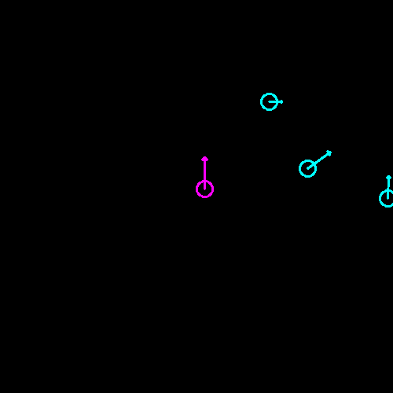

## 5. Post-Processing and API

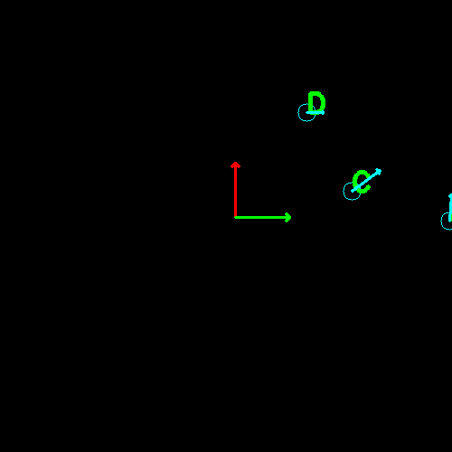

The raw plot can be kind of jittery because of image noise, low camera resolution, etc. The system will average the position of each marker over time to get a more stable and accurate plot. This smooth plot is also available using a REST API for other devices to use.

In order to do this, however, the system needs to keep track of each marker. In each new frame, when markers are found, it needs to determine if each marker is a new marker introduced into the scene or an existing marker being moved. To help keep track of markers across frames, letters are assigned. This also helps API clients keep track of markers.

## Additional Feature: Labels

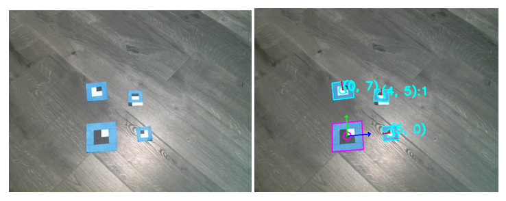

There is another type of marker with 2 black squares. These are labels, and they contain additional squares below the marker to identify it. These squares are read the same way as the squares inside the marker. As shown in the readout, this label has the number “1”. Labels show up with their number on both the raw plot and the smooth plot, and are identified by their number through the API.

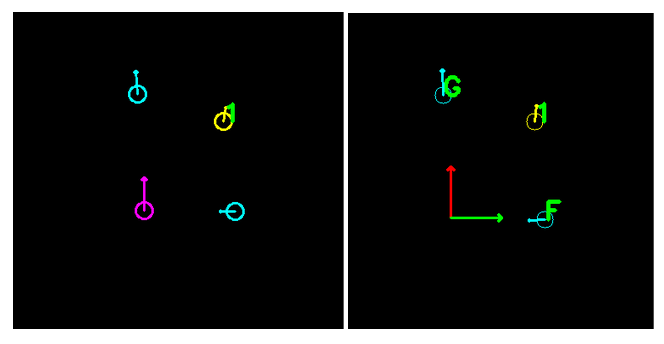
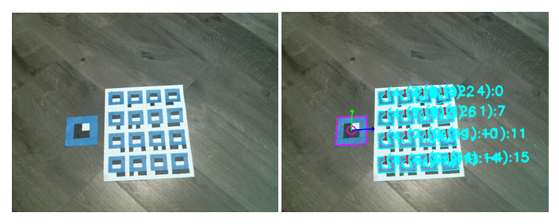

I made a sheet of all possible labels. It’s difficult to see each one on the camera view, but the two plots show each label from 0 to 15.

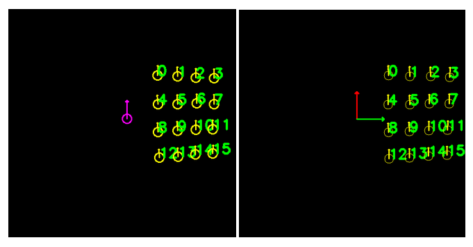

# Results

This project proved that a system using an overhead camera and computer vision markers can be a reliable method of localization for small robots. However, there are definitely issues with the approach that I did not anticipate.

## Unreliable Marker Corner Detection

In this system, the corners of each marker were used to create the transformation matrices. Because of this, any issues in the detection of these corners will distort the resulting transformation and affect the calculated position of all other objects in the scene. This means that slightly misshapen markers, backgrounds with a similar hue to the markers, and other small issues can cause extremely inaccurate results.

This could be mitigated by using points within the marker to calculate this transformation, but overall, extrapolating one small reference marker to cover a large area will magnify any errors caused by lens distortion, image blur, etc. and make the entire system much less precise.

In order to increase the precision of the system, multiple reference markers should be used. However, this raises questions: How will the system know the distance between each marker? Will users be required to precisely set up multiple markers at exact distances from each other? In any case, this would make the system more difficult to deploy and use.

## Unreliable Marker Filtering from Background Objects

Because the system detects markers based on color, any other blue objects in the scene may cause markers to be detected which aren’t actually markers. Additionally, color detection is unreliable because changes in lighting type and strength can influence how colors appear.

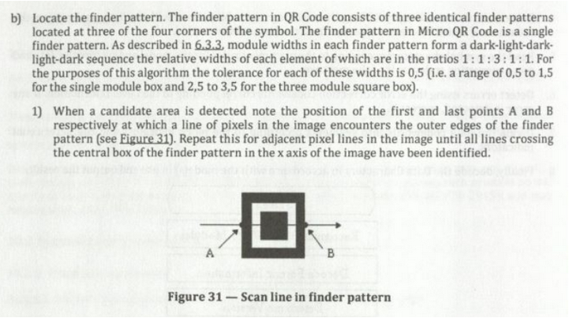

<Caption>
An excerpt from the QR code specification describing how the "Finder Pattern" can be recognized.
</Caption>

A common method for detecting other sorts of computer vision markers is to look for some pattern in the lightness of the code. For instance, QR code scanners look for the 1-black, 1-white, 3-black, 1-white, 1-black pattern in the corners of each code. Designing a computer vision marker which can be identified using this technique would significantly reduce the error in this portion.

However, using a method such as this one would require more processing power, making the system slower and less capable of running on low-end hardware like the Raspberry Pi. It might also reduce the camera resolution that the system can run at.

## Poor Coverage Area

<Caption>
A diagram of the effective coverage area of my camera-based LPS system.
</Caption>

Because of the camera’s limited resolution and field-of-view, the usable area of the system is weirdly shaped. This limits the effectiveness of the system, as most areas are not this weird shape. Multiple cameras could be used to increase the effective area, but this complicates the system and increases the cost significantly.

## Closing Thoughts

Despite these issues, the system does accomplish the goals I set out at the beginning of the project. However, because of the system’s mediocre accuracy and reliability, I do not anticipate using it for anything in the future in its current state, although I do think this approach to localization is potentially useful (albeit with a lot more refinement).

I am curious as to how much better this sort of system would work if some of the aforementioned solutions were implemented. A system using four separate reference markers instead of one, QR-style finder pattern codes to help objects be more accurately recognized, and perhaps multiple cameras positioned on opposing sides of the area would likely have a much more useful accuracy. Although such a system would be more difficult and expensive to set up and operate, it would still be a practical and economical solution for providing localization capabilities to one or more robots in an enclosed area.

## FAQ (Fully Anticipated Questions)

**What language was this written in?**

I built this using Python, with OpenCV handling some of the heavy lifting for computer vision. I chose Python because I was familiar with it, but it would definitely be possible to implement a similar system in JavaScript for a web version.

**Why invent your own computer vision marker instead of using some existing standard?**

I tried to use QR codes, which would’ve saved me from doing most of the computer vision work and would’ve allowed me to focus on the linear algebra side of things, but the camera resolution was too low for that to work well. QR scanner libraries are built to recognize one or two codes positioned close to the camera, not many small codes positioned far away.

In hindsight, I’m kind of glad I had this problem, because working with computer vision was honestly pretty fun. I hadn’t really done anything in this field before.

**Why is the camera resolution so low?**

I ran this at 480p because OpenCV isn’t able to grab 1080p video from my camera any faster than 5 fps. (Which isn’t really a problem on its own, as things aren’t generally moving that fast, but my camera has rolling shutter, which warped any moving markers on the screen into an unrecognizable state.) The processing done by my software doesn’t really take that much time, so it should be possible to run this sort of system at much higher resolutions.

**Why does the hue filter still capture non-blue things (e.g. the purple pencil and textbook)?**

My camera doesn’t let me turn off auto white balance and automatic exposure compensation, so these parameters were frequently changing while I was trying to work on my system. Because of this, the hue range (and lightness/saturation ranges) I chose had to work for all sorts of white balance and exposure settings.

**Why not just buy or borrow a better camera?**

The whole point of this project was to solve a difficult problem - precise localization - using tools I already owned. That means working around the inherent limitations of the hardware. I also wanted to try to make the system as cheap to deploy as possible, so I used my cheap-ish and commonly available webcam.

**Why blue painters’ tape for the border?**

I tried using red, but my skin kept making it past the filter and screwing up the marker detection every time I reached into the scene. I also had a lot of problems with marker on paper being surprisingly glossy: portions of the border were appearing white on the camera instead of blue because of reflected light.

**Why only 16 possible labels?**

At first, I let labels have an arbitrary number of squares. I found that the further squares were from the marker border, however, the less accurate the calculated position (yellow grid) would be, and these multi-line labels had a lot of scanning errors as a result.

**Why not use colored squares to determine the marker type? This would let you define many more types of marker.**

This works fine for two colors, but trying to distinguish between any more becomes difficult, especially in a variety of lighting and white-balance scenarios. I tried using red-green-blue, but there were too many errors for it to work well.
