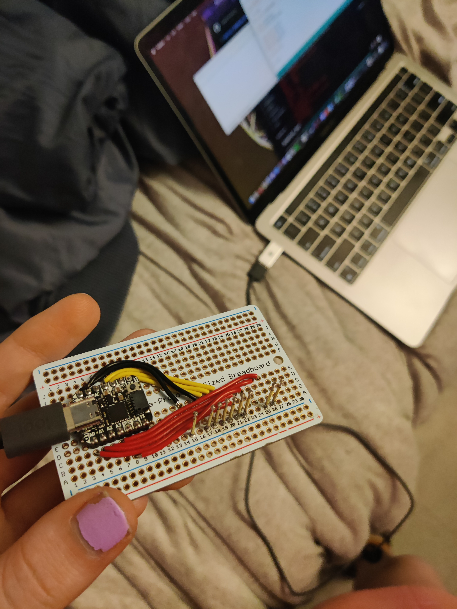

<Caption>The necklace, in two separate frames. On the left, it shows my radio license in a heart-shaped frame, on the right, it shows a message my friend came up with in a square frame.</Caption>

# Overview

This project is a necklace/amulet which can display a message on an e-Ink display. The persistence of the e-Ink makes it so that the display, once updated, does not require a battery to hold the image.

# Motivation

I was inspired by a display pendant idea I found on [Adafruit](https://learn.adafruit.com/trinket-slash-gemma-space-invader-pendant?view=all) which used an ATTiny85 and an LED matrix display to show an animation. I wanted to experiment with a wearable project, but I didn't want to have to remember to charge it or design it around a large battery.

I was also looking for an excuse to use an e-Ink display for a project, due to their unique design considerations and low power requirements. I decided an e-Ink screen could be a good fit for this project.

# Technical Description

The project consists of a monochrome [e-Ink display](https://www.adafruit.com/product/4196) mounted in a 3D printed frame. Pogo pins on a programming board I made are used to connect to the pins on the display breakout board.

<Caption>The programming board, featuring an M0 board and a row of pogo pins.</Caption>

I've printed two frames that I can switch between: a smaller, square one and a larger, heart-shaped one.

# Results

Even though I didn't put any special attention into weatherproofing, I've worn the necklace outdoors / in the rain / on the beach plenty and I haven't had any issues. This is probably because there is no onboard power: even though there is no special ingress protection, the display is fine as long as it is dry when programmed. Also, the 3D printed frame seems to fit the display tightly enough that dust/dirt/sand exposure doesn't pose much of an issue.

The programming process ended up working pretty well, and it's definitely something I could change every day if I had the motivation to. The pogo pins do require force to push the display against them, and slipping up at the wrong moment can cause the display to be refreshed improperly, causing issues. Some sort of latch to hold the display in place during programming could have remedied this.

Overall, I'm happy with how this project turned out, and the necklace (with clever message) has become a common feature of my daily outfit.
