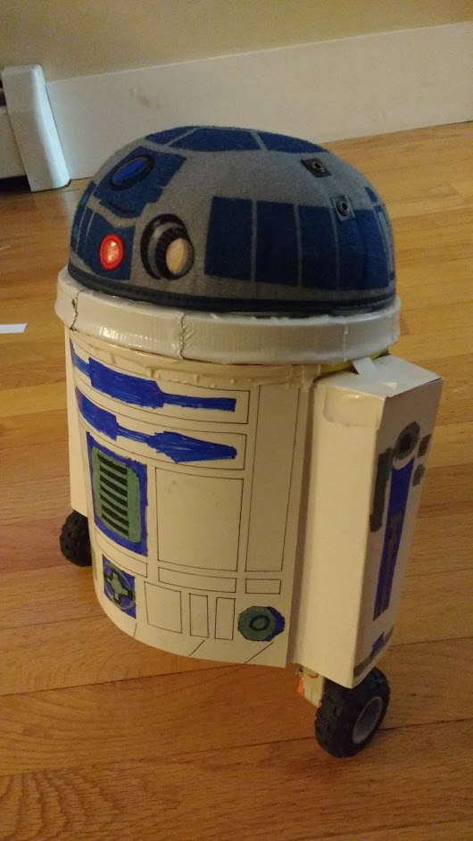

<Caption>
If you're wondering, the chassis is an old Play-Doh bucket.
</Caption>

# Overview

Exactly what it says on the tin: a remote-controlled robot built to look like R2D2. As time went on, I did add some more advanced features, such as text-to-speech and video streaming.

# Motivation

This was made for several occasions: the STEM fair, and Halloween later that year when I went trick-or-treating as Luke Skywalker.

# Technical Description

I started with the guts of an earlier robot I had built: two Lego NXT motors, connected to a Raspberry Pi through an H-Bridge motor driver. I spent a lot of time adding features to this robot: it could be controlled using a Wii remote, a smartphone app, or an interactive website. It had speech synthesis software and an internal speaker, a camera mounted to allow video streaming, and a few LEDs for blinkenlights.

By the end of the project, I had switched to using an NXT brain to control the motors, connected over USB to the Raspberry Pi.

# Results

It did its job and did it well. This project was one of the first significant software projects I worked on, and it taught me how to design and organize a program longer than just a few lines.
