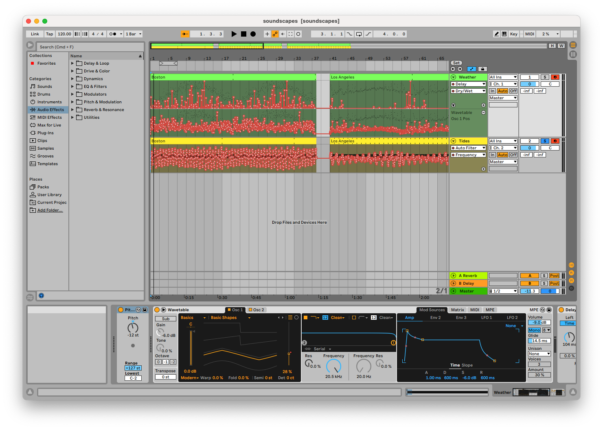

<Caption>A screenshot of the sonification project in Ableton Live, with data mapped to automation lanes and MIDI notes.</Caption>

<SoundCloud url="https://soundcloud.com/breq/soundscapes" />

<Caption>The final sonification, featuring sounds generated from Boston, Los Angeles, and Anchorage data.</Caption>

# Overview

In this project, I attempted to use data sonification techniques to create abstract soundscapes for various cities. Notably, the process of producing sounds from data is as similar as possible between the various cities, to allow the listener to compare and contrast these cities based on each soundscape. I wanted the listener to be able to understand the different aesthetic of each soundscape as a whole, but I also wanted to enable the listener to recognize how specific measurements and data points differed both over time and between cities.

One challenge I had was balancing the aesthetics of the compositions with the need to convey information. Sonification typically uses more abstract sound sources, but these can sound jarring and disjointed. Alternatively, soundscapes often blend layers of sound together, but this using this approach could impede the actual presentation of data. As I wanted to create a piece which could serve both purposes, I needed to find a compromise between these opposing goals.

To solve this, I decided to focus solely on facilitating comparing and contrasting of data. Thus, I could tweak the processing of data to achieve a more pleasant sound, and as long as I applied these tweaks equally to each city, it would not impact the listener’s ability to compare between cities. An example of this sort of tweak is mapping data to notes of the major scale instead of arbitrary pitches: this removes distracting dissonance and yields a more musical result, but it does further decouple the audio result from the data it is based on.

# Motivation

I drew some inspiration from soundscape compositions, which framed naturally occurring sounds in a more narrative way. Instead of sounds recorded from nature with a microphone, however, I worked with sounds generated from natural data. I focused on natural data partly as an homage to soundscape compositions. I only used data from the span of one year, but a future project could examine multiple decades to show a more dynamic view of the climate.

One of the primary criticisms of sonification as a field is bias in the data processing: when creating an algorithm to convert data into sound, people are likely to have some preconceived notion of what the result should sound like. (For instance, sonification of space-themed data often uses whooshing noises, not because they aid in interpreting the data, but because science fiction has taught us that is what space should sound like.) The mapping from data to sound should leverage existing intuition if possible to help listeners understand the audio, but it should not detract from the data itself. These decisions have to be arbitrary, making this a difficult problem to solve. I drew heavily on Tantacrul's [critique](https://www.youtube.com/watch?v=Ocq3NeudsVk) of sonification during this project to understand this balance.

One of the most important facets of this project is that the same processing is applied to each city. My hope is that this reduces the likelihood that the processing step I have developed is biased towards telling a specific story or focusing on a particular theme. Without this restriction in place, I might allow my own understanding of cities to influence the results of the sonification instead of letting it be driven by the data.

# Technical Description

I sourced weather data for this project from NOAA’s free Climate Data Online service. This service gives daily temperature, wind, and precipitation data for a large number of stations both in the US and globally. Most US cities had multiple stations to choose from, and I specifically chose stations from the largest nearby airport (as these stations often report more data). I chose to analyze data over the course of one year, since it was a short enough interval for individual days to be represented as notes while being long enough to demonstrate the periodic nature of the seasons. I looped this data to emphasize this repetition. I also sourced tidal data from NOAA’s Tides and Currents service.

While I wanted to try to incorporate additional sources (such as public transit data, air traffic data, or highway traffic data) into the soundscape, I could not find a practical way to accomplish this. Although many cities have transit APIs, these lack consistency, and they generally only provide data about the current location of trains and the predicted future schedule (whereas this project is more focused on historical data). Most air traffic APIs are similarly focused on present and future data only, and their rate limits would not allow me to retrieve a year’s worth of data at once for this project. Finally, highway traffic is generally not precisely measured on a real-time basis.

To process this data, I first used a Jupyter notebook and Python code. This program would read the data from each source, then map each data point to one or more MIDI messages. These messages were organized first by city, then by data source, then by “tick” / instant in time. Messages could be grouped together to occur at the same instant, and a list of “cleanup” messages was kept ensuring no notes were left playing if the audio was stopped early. I arbitrarily chose that a tick would represent 1/20 of a second, as it was fast enough for the data to sound continuous but slow enough for the ear to pick out individual data points.

```python
CITIES = ["LAX", "ANC", "BOS"]

@dataclass
class Tick:
    messages: list[mido.Message]
    cleanup: list[mido.Message]

TRACKS: dict[str, dict[str, list[Tick]]] = {
    city: {
        "weather": [],
        "tides": [],
    } for city in CITIES
}
```

Additional Python code could then play back these tracks simultaneously over different MIDI channels. An Ableton Live set was configured to receive MIDI input, send separate channels to separate tracks with separate instruments, and map MIDI CC messages to instrument parameters to allow them to be controlled by the incoming data. Finally, the resulting audio was recorded using Ableton Live. I chose this workflow because I had familiarity with these tools, having used Ableton Live for production and Jupyter notebooks for analysis (albeit not simultaneously). Although I experimented with using Max/MSP for a potentially cleaner and more extensible implementation, the timeline for the project made a familiar workflow more pragmatic.

I decided to select cities with different climates in order to highlight their differences. I started with Boston, as I have familiarity with its climate. I considered New York, but I decided against it due to its proximity to Boston and similar weather. Next, I chose Los Angeles due to its famously stable climate, followed by Anchorage for its unique geographic location.

While creating the sonification, I noticed that it was difficult to effectively use pitch to represent multiple measurements. Generally, pitch is an appealing quantity to map to, since it has such a wide range and is easy for the ear to recognize. However, mapping multiple quantities to different pitches simultaneously raised some problems. When multiple pitches are being played simultaneously, the listener can end up focusing on the interval instead of each separate note. This detracts from the interpretation of data since whether the interval is major or minor typically does not represent anything. This issue can be remedied somewhat by using distinct sound sources or by playing in separate registers, but I still decided to only map one measurement to pitch.

Another tradeoff I made related to the continuous nature of the phenomena being sonified and the discrete nature of the measurements taken. I found that directly mapping measurements to synthesizer controls could produce a result which sounded discontinuous and disjointed, and I considered implementing some form of interpolation to make the audio result sound smoother. Ultimately, I decided against this, as it could potentially lead to a misleading presentation of the data. This decision, however, did make the audio result less pleasant to listen to, and it compromised on the soundscape aesthetic which I was trying to achieve.

After making these tradeoffs, I eventually decided that trying to create a meaningful and useful sonification which was also an artistic piece following the aesthetic of a soundscape would not be a feasible endeavor. [The aim of sonification is to present data in a scientific sense for the ear to recognize new patterns, not to create a piece of music.](https://sonification.de/son/definition/) Massaging the data and representation to fit a specific predetermined aesthetic is fundamentally at odds with this goal. To be true to the sonification of data, I decided to focus less on the soundscape aspect of the project.

This also highlighted a flaw in my earlier assumption that the comparative nature of this project could help eliminate bias. Although the sonification would not be biased based on one specific city’s impact on popular culture, it could still be biased based on my preconceptions about what aesthetic cities should have, the cultural significance of the weather, and other factors unrelated to the data itself. Additionally, through chasing a particular aesthetic, the resulting sonification could lose information, making it less effective at triggering new insights.

I decided to use two sound sources: a wavetable synthesizer to represent the weather data, and white noise to represent the tidal data. The pitch of the wavetable was controlled by the maximum temperature on a given day. I used the Ableton “Basic Shapes” preset and mapped the wavetable parameter to the wind speed such that calm days were represented by sine or triangle waves and windy days were represented by sawtooth waves. Finally, I used a low-pass filter on the white noise controlled by the water level to represent the tides.

I used linear equations to map specific data values to notes or parameter values, attempting to show as much of the usable range as possible. However, while tuning these equations, I focused most on the Boston data. When I tried these equations with the Anchorage data, I found that the temperature dipped below the valid range of note values and the tide data was typically beyond the possible extremes of the control. The tide data was still understandable, but the temperature graph was inaudible during winter.

With a visual graph, I would simply make the graph taller to include all of the relevant information. With sonification, however, I have to work within a limited range of notes. I considered adjusting the mapping to raise all notes up, but that could have caused issues with representing the Los Angeles summer (or any warmer cities, for that matter). I also considered making the mapping denser to fit both low and high temperatures, but that would have made the Los Angeles data harder to understand (as there was little variation from winter to summer anyway, and I wanted to not flatten this any further). I also could have shifted just the Anchorage data up. While that could have helped the listener understand more about the climate of Anchorage, it would have interfered with their ability to compare the data with the other cities. Eventually, I decided to leave the equations in place, allowing some of the Anchorage data to be missing from the audio result.

# Results

Overall, the sonification I produced has some utility, although it did not accomplish the goals I started with. While developing the data processing pipeline, I found that I needed to let go of my expectations for the aesthetic of the result if I wanted the data to be presented in a meaningful way. I also found it more difficult than expected to develop a mapping from data to sound which leveraged the existing intuition of the listener without being biased towards a particular narrative and overshadowing the data. Listening to the end result, I can certainly hear and recognize specific differences between the cities: the stable climate of Los Angeles, the harsh winds of Boston, and the extreme tides of Anchorage.
