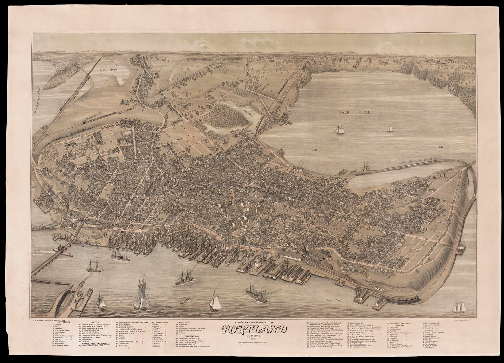
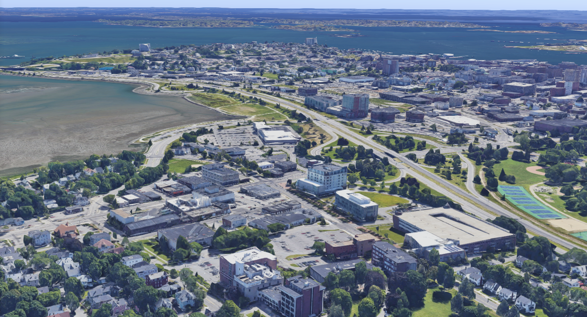
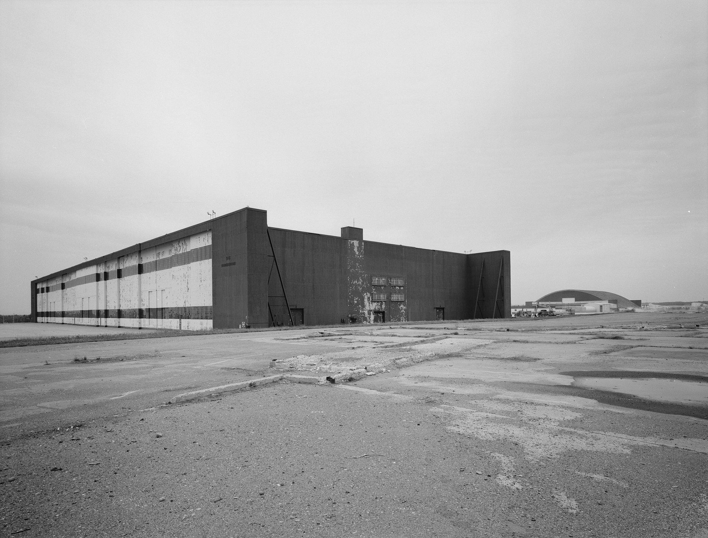
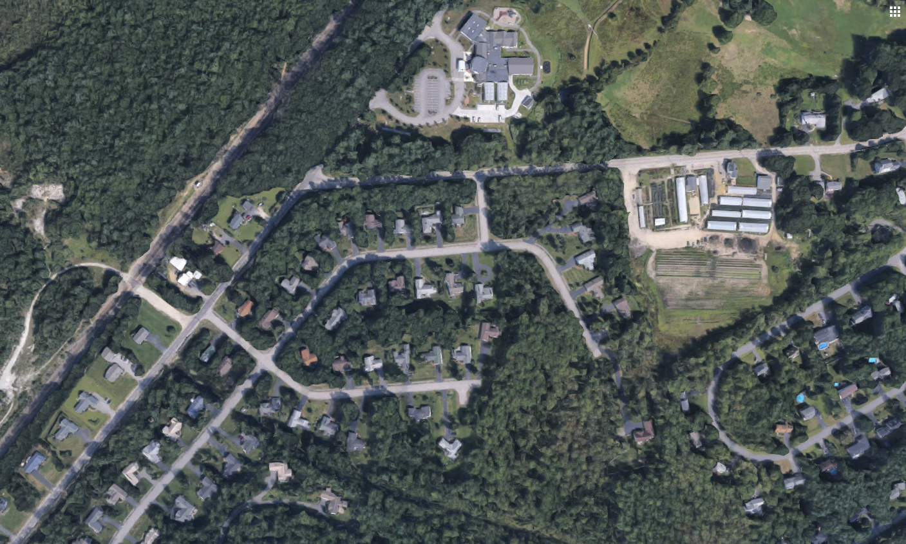

# Franklin St

<Caption>
  Bird's Eye View of the City of Portland Maine, 1876. Osher Map Library Sheet
  Map Collection.
</Caption>

I look at the sketch looking down on Portland. Wharfs line the southern coast, and railroads loop and dart across the landscape. Although the map is from 1876, the street names are instantly recognizable. Commercial Street looks as bustling as it does today: pedestrians quickly move out of the way of horses, just like I sprint on my bike to avoid cars backing up from the angled parking. That five-pointed intersection where High Street crosses Congress Street seems just as confusing to the horse on the map as it does to me in my car. The streets of the East End were just as narrow and difficult to navigate then as they are were for me last weekend. And then I saw it: my friend’s house, sitting on the hill, looking over Atlantic Street, standing in the exact same place that it does today. The people shown walking around, riding the trains, and going about their lives don’t have much in common with me. I often feel as if my generation lives in a completely different world, one with technology, connectivity, transportation, and all the other changes that have made the past so unrecognizable. But this map demonstrates that the people who lived in Portland over a century ago truly did live in the same city that means so much to me today.

# US-1A

In 2017, I left my hometown and went to a boarding school in Limestone, Maine. The neighborhood I grew up in is made up of tightly-packed houses connected by roads that loop and woosh and curve around them, with cul-de-sacs and footpaths and friendly neighbors who would let you pet their dogs if you let them pet yours. As I got older, my family started to go downtown more often. We’d take 295, the road that gently curves across the Fore River and soars over Congress Street. Then, we’d find a parking space on the grid of the city, that jumbled mess of angled parking, confusing intersections, and sidewalks full of all sorts of people laughing and chatting with each other. Limestone, on the other hand, was just a grid of worn-down roads dividing the land into a checkerboard, potatoes farmed in one square, broccoli farmed in the next. I used to think my neighborhood felt empty compared to Portland’s bustling streets, but Limestone felt absolutely lifeless.

# Smyrna Center Rd

_My dad was a big Pearl Jam fan growing up. When we would make the five hour journey up to the school for him to drop me off, once the cell service cut out, Vs. was one of the only albums we had downloaded._

> I seem to recognize your face  Haunting familiar, yet I can't seem to place it  Cannot find the candle of thought to light your name  Lifetimes are catching up with me  All these changes taking place  I wish I'd seen the place  But no one's ever taken me 

<Caption>Pearl Jam, “Elderly Woman Behind the Counter in a Small Town”</Caption>

# High St

<Caption>
  USM Portland and Interstate 295, Portland, Maine. Google Earth.
</Caption>

I sat in my math professor’s office. Room 581C, Science Building, Portland campus. It had taken me a while to find the door with John Brunette’s name, but I made it just in time for our meeting.

“You’ve got the best view on campus,” I remarked, as I looked out the window. His office looked out over Back Cove, which shimmered in the sunlight, and the east end, with its buildings up on the hill. The interstate cut right between them.

Of course, the interstate didn’t always cut through Portland. On that map of Portland from 1876, Kennebec Street lines the northern coast of the peninsula, and Mill Pond lies where my professor’s office stands today.

Professor Brunette explained how, when he was younger, he used to watch the rotation of trucks filled with dirt drive to the edge of the cove, dump dirt over the shore, drive away empty, pick up more dirt, and continue the cycle again and again. He had slowly watched the coastline change, bit by bit, into how it looks now.

With the purpose of our meeting long forgotten, I listened as my professor described his life in Portland, and how he witnessed it change as he grew up. For him, the window wasn’t just a pretty backdrop. It was a reminder of how he had changed, and how Portland had changed around him.

# ME-89

<Caption>
  Loring Air Force Base Double Cantilever Hangar. Historic American Engineering
  Record.
</Caption>

Loring AFB, located in Limestone, Maine, is the closest point in the US to Europe. It was constructed at the beginning of the Cold War, due to its proximity to Russia. But when the Cold War ended, the government decided that the base had served its purpose, and it has been left abandoned and untouched ever since.

When I first rode my bike through Loring, I was struck by the scale of the decaying buildings around me. Massive aircraft hangars towered over the landscape, their walls covered in rust. The landscape was covered in a network of highways, each one as wide as the crowded interstates I grew up near, yet there wasn’t a car in sight. And then, realizing I had become lost in the maze of crumbling roads, I reached into my pocket to pull out my phone.

It wasn’t there.

I had no map, no way to communicate, no sense of direction, no idea when the sun would set, no idea how far away I was from the school, no one nearby to ask for directions, not even an occupied house in sight, no one at the school even knew I was gone--

In that moment, I felt vulnerability like I’d never known. I was at the mercy of this place, its imposing buildings, its twisting roads. I took a deep breath and began retracing my steps.

After a moment, I found my phone, lying screen-up in the middle of the massive intersection of two four-lane highways... untouched.

And then it hit me. The reason this place felt so hostile to me wasn’t just the large buildings, or the wide streets--there were plenty of those in Portland too, after all. The reason the base felt hostile was that I was staring at its corpse. The base had lived its life and died its death, and here I was, digging up its grave after its time had passed.

# NB-375

Abigail Thorn makes video essays for her YouTube channel, PhilosophyTube, that apply ideas from historical philosophy to help explain phenomena in the modern world. She has covered topics ranging from the video game industry to the philosophy of suicide. The following is from her video about the Split Mind Theory.

> “Sometimes this can verge into actual mental illness, but the vast majority of people have an experience like this - not a literal voice, but a feeling of should, of shouldn’t, a feeling of monitoring and critiquing their own behaviour, as it were, from the outside. I call my internal voice Mr. Not Good Enough, because that’s all he ever tells me. And he’s a very skilled actor, Mr. Not Good Enough, sometimes he appears in disguise as the voice of reason or the voice of common sense and it’s only when I stop and think about it that I realise all he’s really ever telling me is, ‘You’re Not Good Enough.’”

<Caption>Abigail Thorn, “Why Do I Hate My Self?”</Caption>

# State St

<Poem>

Tracks cover the city, as if some titans spilled their leftover spaghetti noodles

up and down wharfs, over bridges, along streets, the railroad dominates

the landscape. But today,

the airport has become Portland’s aorta, the divided highway its venae cavae, the rumble

of trains replaced with the racket of planes and automobiles, the streets no longer covered in arteries

of iron. Yet one track remains, stretching over the Fore River.

 

Once, as a child, I climbed aboard that train, and held on to my seat as it whooshed across the river,

through forests, over marshes, gracefully curving like the last noodle

on your plate does, dancing timidly around Saint John Street, a blocked artery

that no longer flows to the heart of the city it used to dominate.

I can hear that train’s horn from my house, when I’m staying up late and it feels as if no one else in the world is awake, at 1:35 AM, at 2:33 AM, at 3:47 AM, that characteristic rumble.

The train shown on the map, passing through those tracks, may be frozen in time over a century ago, but the sound of it echos through my room today.

</Poem>

# Weinman Rd

A year after my first visit to Loring, my anthropology teacher offered to ride with me through the base on our bikes. This time was different. He told me stories of the joyful kids at the elementary school, which one stood in that empty lot. He told me about the B-52s that the Air Force used to keep in that hangar. He told me about the rock concert that Phish played, which attracted a crowd so large and vibrant that, for just one night, Limestone was the largest and loudest city in Maine.

89%. That’s how much the Limestone population decreased after the base closed. It’s one thing to look at an old map of Portland and compare then and now, but it’s another to look at Loring and realize, there may have been a “then,” but there really is no “now.”

# Ln Terrace St

I never understood this song when I was growing up. At home, there was an endless supply of places I’d never been before, people I’d never met, and things to do I’d never done. It wasn’t until I spent time in Limestone that this song finally clicked for me.

> I swear I recognize your breath  Memories, like fingerprints, are slowly raising  Me you wouldn't recall for I'm not my former  It's hard when you're stuck upon the shelf  I changed by not changing at all  Small town predicts my fate  Perhaps that's what no one wants to see 

<Caption>Pearl Jam, “Elderly Woman Behind the Counter in a Small Town”</Caption>

# Highland Ave

<Caption>Highland Ave, Scarborough, Maine. Google Earth.</Caption>

<Poem>

The train isn’t coming anymore,

And everything is turned upside down.

I listen but never hear its horn,

The train isn’t coming anymore.

A threat the world’s never faced before,

Too small to see, yet feared through the town.

The train isn’t coming anymore,

And everything is turned upside down.

</Poem>

# W Gate Rd

It’s 2019, and my first day going to classes in the early college program. I had spent months deliberating before deciding to try this. I had talked with the early college advisor and with my professors. I had done everything I possibly could do to prepare for this day. But despite all that, it was taking all my strength to keep breathing while I was hurrying through the building and searching for the room number that I had written down on a sticky note. Eventually, I find the door. I glance around the room and quietly, cautiously, take a seat near the entrance. I set my backpack under my chair, careful to take up no more space than I absolutely need to. I feel inadequate, almost apologetic for my presence in the class. My breathing becomes harder to control. The pencil in my hands starts to tremble. But then, I look out the window of the fifth floor lecture hall, and see the recognizable skyline of Monument Square, with the Time and Temperature Building flashing in the distance. This is my home. This is the city that I’m from. This is the place where I belong. And a wave of calm rushes over me, just as my professor walks into the room.

When I first saw the map from the Osher Map Library, I started to look for Monument Square almost immediately, following Congress Street until… was that really it? No monument, no tall buildings? The area so central to Portland today looked almost unrecognizable except for the distinctive street layout. But that doesn’t matter. The city may have grown around the square, but it’s the same city, and it’s the same square, Theseus and his ship be damned. It was a welcoming place then, and it’s a welcoming place now. It was important to people then, and it’s important to people now. It felt like home then, and it feels like home now.

# Brackett Ave

There’s one series of videos on Abigail Thorn’s channel that are unique, that she calls the Blackstar trilogy. In this series, she uses tools from philosophy to examine and discuss events from her own life. “Why Do I Hate My Self?” discusses her struggles with body image, “Suicide and Mental Health” contrasts prevailing ideas about suicide with her own experiences of suicide attempts, and “Men. Abuse. Trauma.” recounts her past experiences in an abusive relationship.

Earlier this year, Abigail Thorn released a fourth Blackstar video, “Identity,” in which she publicly came out as a transgender woman. She discusses her experiences with depersonalization, depression, and finally coming to terms with her identity.

I’ve always admired Abigail Thorn’s ability to share her struggles with the world. I know they’ve helped me as I’ve struggled with depression.

> “When I was younger I really wanted to see great white sharks in the wild, cause I just think they’re beautiful animals, still do. And I spent all my savings flying 12,000 miles to Australia to go cage diving. And it was a long, long journey - it was like five hours out on the boat into the Southern Ocean - and it was really rough and I was seasick, and the captain was seasick and everyone was seasick, and we spent all day out there going up and down under this blistering Australian sun. And we saw absolutely nothing. And on the way back I was sitting on the boat and I was just thinking, ‘I’ve blown it. I’ve come all this way and I’ve seen nothing. I’ve come so close to what I wanted to do and I’ve failed.’
>
> “And as I was thinking this the sun was going down over the Southern Ocean. And the cool thing about the Southern Ocean is that there’s no land mass in it: It just goes all the way round the bottom of the world forever, right. And as the sun was going down it hit the water in just the right way that it turned the whole ocean this… incredible orange rusty gold colour. It was like an ocean of autumn. It was like the waves were on fire. And I was so, so happy. I had a beer, I had my tunes, I had an infinite ocean to gaze at. And I thought, ‘Even though I’ve come all this way and I’m leaving empty handed, it’s all been worth it.’ The little voice - for just 20 minutes - was gone, and I was just lost in beauty.”

<Caption>Abigail Thorn, “Why Do I Hate My Self?”</Caption>
